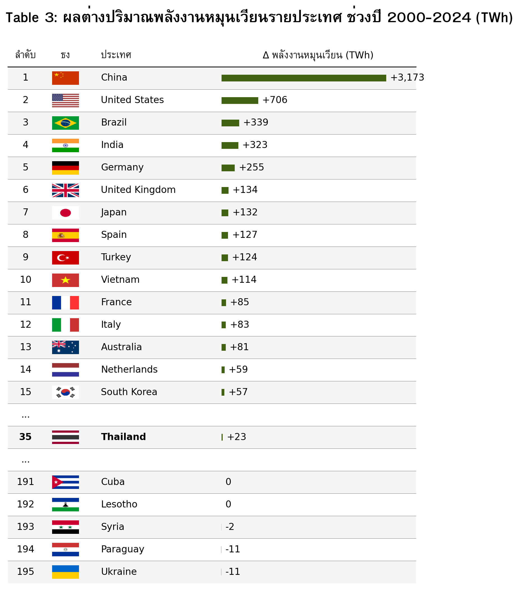
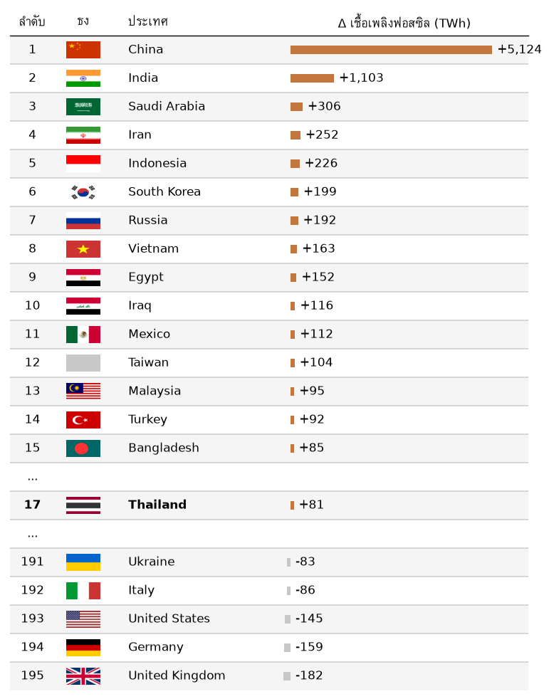

# Transition or Addition? 
ถอดรหัสความจริงเบื้องหลังการเติบโตของระบบไฟฟ้าโลก

โปรเจกต์วิเคราะห์ข้อมูลการผลิตไฟฟ้าโลก ปี 2000–2024 เพื่อตอบคำถาม: **พลังงานหมุนเวียนกำลังเข้ามาเปลี่ยนผ่านเชื้อเพลิงฟอสซิล (Transition) หรือแค่เพิ่มเติมเข้าระบบเพื่อรองรับความต้องการที่โตขึ้น (Addition)?**

คำถามนี้สำคัญเพราะการที่พลังงานหมุนเวียนเติบโต ไม่ได้หมายความว่า เชื้อเพลิงฟอสซิลจะลดลงเสมอไป หากพลังงานหมุนเวียนเพิ่มขึ้น พร้อมกับเชื้อเพลิงฟอสซิลที่ยังเพิ่มขึ้น ระบบอาจกำลังอยู่ในลักษณะ **Addition** คือการเพิ่มกำลังผลิตเพื่อรองรับความต้องการไฟฟ้าที่เติบโตขึ้น ขณะที่ **Transition** ในกรอบของโปรเจกต์นี้ หมายถึง พลังงานหมุนเวียนเพิ่มขึ้นในขณะที่เชื้อเพลิงฟอสซิลลดลง

ดังนั้น โปรเจกต์นี้ไม่ได้มองเพียงว่า พลังงานหมุนเวียนโตขึ้นหรือไม่ แต่พิจารณา **การเปลี่ยนแปลงของพลังงานหมุนเวียน และเชื้อเพลิงฟอสซิลพร้อมกัน** และมองทั้งภาพรวมระยะยาวและแนวโน้มในแต่ละช่วงเวลา เพื่อดูว่า Energy Transition กำลังเกิดขึ้นในลักษณะใด และเกิดขึ้นที่ไหนบ้าง

**คำย่อที่ใช้ในโปรเจคนี้:** TWh (เทระวัตต์ชั่วโมง) หน่วยวัดปริมาณไฟฟ้า | Δ (Delta) ผลต่างของพลังงาน

---

## สารบัญ
1. [ที่มาของคำถาม](#1-ที่มาของคำถาม)
2. [ข้อมูลและขอบเขตการวิเคราะห์](#2-ข้อมูลและขอบเขตการวิเคราะห์)
3. [นิยาม: Transition vs Addition](#3-นิยาม-transition-vs-addition)
4. [ภาพรวมโลก](#4-ภาพรวมโลก)
5. [5-Year Rolling Window: มองแนวโน้ม](#5-5-year-rolling-window-มองแนวโน้ม)
6. [ระดับภูมิภาค](#6-ระดับภูมิภาค)
7. [ระดับประเทศ](#7-ระดับประเทศ)
8. [Insight เด่นและข้อเสนอแนะ](#8-insight-เด่นและข้อเสนอแนะ)
9. [สรุป](#9-สรุป)
10. [ทีมงานและเครดิต](#10-ทีมงานและเครดิต)

---

## 1. ที่มาของคำถาม

พลังงานหมุนเวียนเติบโตต่อเนื่องทั่วโลก ทั้งแสงอาทิตย์ ลม และน้ำ หลายคนจึงคิดว่าโลกกำลังเข้าสู่ "การเปลี่ยนผ่านพลังงาน" (Energy Transition) เต็มตัวแล้ว

แต่คำถามที่แท้จริงคือ พลังงานหมุนเวียนที่โตขึ้น กำลัง **"เปลี่ยนผ่าน"** จากเชื้อเพลิงฟอสซิล หรือแค่ **"เพิ่มเติม"** พลังงานเข้าระบบเพื่อรองรับความต้องการไฟฟ้าที่มากขึ้น?

ถ้าพลังงานหมุนเวียนเพิ่ม แต่เชื้อเพลิงฟอสซิลก็เพิ่มตาม นั่นยังไม่ใช่การเปลี่ยนผ่านตามนิยามของโปรเจกต์นี้ โปรเจกต์จึงใช้ข้อมูลการผลิตไฟฟ้าโลกปี 2000–2024 เพื่อดูว่า การเติบโตของพลังงานหมุนเวียน เกิดขึ้นพร้อมกับการลดลงของเชื้อเพลิงฟอสซิลหรือไม่

## 2. ข้อมูลและขอบเขตการวิเคราะห์

| | |
|---|---|
| **ชุดข้อมูล** | Electricity Generation by Country and Source (2000–2025) |
| **แหล่งที่มา** | Our World in Data / Ember Climate |
| **ความครอบคลุม** | ข้อมูลระดับประเทศมากกว่า 190 ประเทศ แยกตาม เชื้อเพลิงฟอสซิล, พลังงานหมุนเวียน และนิวเคลียร์ |
| **ตัวชี้วัดหลัก** | ปริมาณผลิตไฟฟ้า (TWh) และสัดส่วนต่อยอดผลิตรวม (%) |

**ขอบเขต:** ดูเฉพาะภาคการผลิตไฟฟ้า ไม่รวมภาคขนส่งหรือการเผาเชื้อเพลิงโดยตรงในโรงงาน เพราะเป็นจุดที่ พลังงานหมุนเวียน กับ เชื้อเพลิงฟอสซิล ป้อนไฟฟ้าเข้าระบบเดียวกันโดยตรง ผลสรุปในเอกสารนี้จึงสะท้อนเฉพาะระบบผลิตไฟฟ้าเท่านั้น

## 3. นิยาม: Transition vs Addition

แบ่งการเปลี่ยนแปลงเป็น 4 แบบ ตามทิศทางของพลังงานหมุนเวียน และเชื้อเพลิงฟอสซิลในช่วงเวลาเดียวกัน

**Table 1: เกณฑ์การจำแนกประเทศตามการเปลี่ยนแปลงของการผลิตไฟฟ้าจากพลังงานหมุนเวียนและเชื้อเพลิงฟอสซิล**

*Caption: ตาราง 2×2 แถวคือทิศทางของ พลังงานหมุนเวียน (เพิ่มขึ้น/ลดลง) คอลัมน์คือทิศทางของเชื้อเพลิงฟอสซิล (ลดลง/เพิ่มขึ้น) สีเขียว = Transition, สีส้ม = Addition, สีเทา = Decline (ลดลงทั้งคู่), สีแดง = Fossil Expansion ไม่มีหน่วยตัวเลข เป็นตารางนิยามเชิงแนวคิด*

**Table 2: ความหมายของประเภทการเปลี่ยนแปลงตามเกณฑ์การจำแนก**

*Caption: อธิบายความหมายของแต่ละประเภทการเปลี่ยนแปลงตามกรอบการจำแนกในตารางที่ 1*

นิยามนี้เป็นเกณฑ์หลักที่ใช้ในการจำแนกและตีความผลการวิเคราะห์ในทุกระดับ ตั้งแต่ระดับโลก ระดับภูมิภาค จนถึงระดับประเทศ

## 4. ภาพรวมโลก

ตั้งแต่ปี 2000 การผลิตไฟฟ้าจากพลังงานหมุนเวียนของโลกมีแนวโน้มเพิ่มขึ้นอย่างต่อเนื่อง สะท้อนถึงการขยายตัวของแหล่งพลังงานหมุนเวียนในระบบไฟฟ้าโลก

**Figure 1: ปริมาณผลิตไฟฟ้าจากพลังงานหมุนเวียนทั่วโลก ปี 2000–2024**

*Caption: แกน X คือปี แกน Y คือปริมาณผลิตไฟฟ้าจากพลังงานหมุนเวียน หน่วย TWh เส้นสีเขียวคือยอดรวมพลังงงานหมุนเวียนทั่วโลกในแต่ละปี (รวมแสงอาทิตย์ ลม น้ำ) ที่มา: Our World in Data / Ember Climate*

อย่างไรก็ตาม การเพิ่มขึ้นของพลังงานหมุนเวียนเพียงอย่างเดียวไม่เพียงพอที่จะสรุปว่า ระบบไฟฟ้ากำลังเกิดการเปลี่ยนผ่าน จากเชื้อเพลิงฟอสซิล  เนื่องจากต้องพิจารณาควบคู่กันว่าปริมาณเชื้อเพลิงฟอสซิลมีแนวโน้มลดลงหรือไม่

**Figure 2: เชื้อเพลิงฟอสซิลเทียบกับพลังงานหมุนเวียนแบบพื้นที่สะสม ปี 2000–2024**

*Caption: แกน X คือปี แกน Y คือปริมาณผลิตไฟฟ้าสะสม หน่วย TWh พื้นที่สีส้ม = เชื้อเพลิงฟอสซิล พื้นที่สีเขียว = พลังงานหมุนเวียน วางแบบ stacked (ซ้อนกัน) เพื่อให้เห็นทั้งขนาดสัมบูรณ์และสัดส่วนไปพร้อมกัน*

**สิ่งที่เห็น:** ตลอดช่วง 24 ปีที่ผ่านมา การผลิตไฟฟ้ารวมของโลกมีการเพิ่มขึ้นอย่างต่อเนื่อง ขณะที่การผลิตไฟฟ้าจากเชื้อเพลิงฟอสซิลไม่ได้ลดลงตามการขยายตัวของพลังงานหมุนเวียน แต่ยังคงเพิ่มขึ้นควบคู่กัน แม้ว่าพลังงานหมุนเวียนจะมีสัดส่วนในการผลิตไฟฟ้ารวมเพิ่มขึ้นอย่างชัดเจนในช่วงหลัง

**Figure 3: เปรียบเทียบส่วนที่เพิ่มขึ้นของแต่ละแหล่งพลังงาน ปี 2000 → 2024**

*Caption: แกน Y คือปริมาณผลิตไฟฟ้า หน่วย TWh แท่งสีเทา = ยอดรวมปี 2000 (15,279 TWh) และปี 2024 (30,820 TWh) แท่งสีส้ม = ส่วนเพิ่มจากเชื้อเพลิงฟอสซิล (+8,363 TWh) แท่งสีเขียว = ส่วนเพิ่มจากพลังงานหมุนเวียน (+6,994 TWh) แท่งสีเทาอ่อนบนสุด = ส่วนเพิ่มจากพลังงานอื่น ๆ/นิวเคลียร์ (+184 TWh)*

**สิ่งที่เห็น:** การผลิตไฟฟ้ารวมของโลกเพิ่มขึ้นเกือบสองเท่าภายใน 24 ปี จาก 15,279 เป็น 30,820 TWh และในส่วนที่เพิ่มขึ้นทั้งหมด **เชื้อเพลิงฟอสซิลถูกผลิตเพิ่มมากกว่า พลังงานหมุนเวียน** (+8,363 เทียบ +6,994 TWh)

พูดง่าย ๆ คือ ในภาพรวมตลอดปี 2000–2024 การเติบโตของพลังงานหมุนเวียนยังไม่ได้มาพร้อมกับการลดลงของเชื้อเพลิงฟอสซิลในระดับโลก และส่วนเพิ่มของเชื้อเพลิงฟอสซิลยังมีขนาดมากกว่าส่วนเพิ่มของพลังงานหมุนเวียน

**ข้อสังเกต:** หากเทียบเฉพาะปี 2000 กับ 2024 ภาพรวมมีลักษณะ **Addition** มากกว่า Transition ตามนิยามของโปรเจกต์

อย่างไรก็ตาม การเปรียบเทียบเพียงสองช่วงเวลาอาจไม่สะท้อนการเปลี่ยนแปลงที่เกิดขึ้นระหว่างทาง เราจึงต้องพิจารณา “แนวโน้ม” ของการเติบโต เพื่อดูว่าการขยายตัวของพลังงานหมุนเวียนและเชื้อเพลิงฟอสซิลเปลี่ยนแปลงไปอย่างไรในแต่ละช่วงเวลา

## 5. 5-Year Rolling Window: มองแนวโน้ม

เทียบแค่จุดเริ่มกับจุดจบ อาจพลาดเรื่องราวระหว่างทาง จึงใช้เทคนิค **5-Year Rolling Window** ดูการเปลี่ยนแปลงทีละช่วง 5 ปีที่เลื่อนไปเรื่อย ๆ

**Figure 4: สัดส่วนที่เชื้อเพลิงฟอสซิล และพลังงานหมุนเวียนร่วมรองรับไฟฟ้าใหม่ในแต่ละช่วง 5 ปี**

*Caption: แกน X คือปีสิ้นสุดของแต่ละช่วง 5 ปี แกน Y คือสัดส่วน % ของไฟฟ้าที่เพิ่มขึ้นใหม่ในช่วงนั้น เส้นสีส้ม = เชื้อเพลิงฟอสซิล เส้นสีเขียว = พลังงานหมุนเวียน เส้นประแนวตั้งทำเครื่องหมายปี 2016 ซึ่งเป็นจุดที่เส้นพลังงานหมุนเวียน ตัดขึ้นเหนือเส้นเชื้อเพลิงฟอสซิลเป็นครั้งแรก ตัวเลขปลายเส้นปี 2024: พลังงานหมุนเวียน 71%, เชื้อเพลิงฟอสซิล 29%*

**สิ่งที่เห็น:** ช่วงแรก (2005–2007) เชื้อเพลิงฟอสซิลรองรับไฟฟ้าใหม่ถึง 80% ขึ้นไป พลังงานหมุนเวียนมีบทบาทน้อยกว่ามาก แต่สัดส่วนของเชื้อเพลิงฟอสซิลลดลงต่อเนื่อง ขณะที่พลังงานหมุนเวียนเพิ่มขึ้นเรื่อย ๆ

**จุดเปลี่ยนคือปี 2016** ปีแรกที่พลังงานหมุนเวียนรองรับไฟฟ้าใหม่ได้มากกว่าเชื้อเพลิงฟอสซิล ในปี 2024 ล่าสุด พลังงานหมุนเวียนรับบทบาทถึง **71%** ของไฟฟ้าที่เพิ่มขึ้นในช่วง 5 ปีล่าสุด ส่วนเชื้อเพลิงฟอสซิลเหลือ **29%**

ข้อมูลนี้ทำให้เห็นว่า ภาพรวม 24 ปีและภาพของช่วงล่าสุดไม่ได้ขัดแย้งกัน แต่กำลังเล่า **มิติใหม่จากข้อมูลเดียวกัน**

- ถ้ามอง **2000 → 2024**: เชื้อเพลิงฟอสซิลยังเพิ่มขึ้นมาก และภาพรวมยังใกล้เคียง Addition
- ถ้ามอง **ช่วง 5 ปีล่าสุด**: พลังงานหมุนเวียนกลายเป็นแหล่งพลังงานหลักที่รองรับไฟฟ้าใหม่ ขณะที่บทบาทของเชื้อเพลิงฟอสซิลในการรองรับไฟฟ้าใหม่ลดลงอย่างชัดเจน

**ยังสรุปไม่ได้ว่า** โลกเข้าสู่ Energy Transition สมบูรณ์แล้ว แต่ผลจาก Figure 4 ที่ใช้เทคนิค 5-Year Rolling Window เป็นสัญญาณชัดว่า **โครงสร้างของการเติบโตของระบบไฟฟ้ากำลังเปลี่ยนไป** โดยพลังงานหมุนเวียนมีบทบาทมากขึ้นในการรองรับไฟฟ้าใหม่

คำถามต่อไปคือ การเปลี่ยนแปลงนี้เกิดขึ้นเหมือนกันทุกประเทศหรือไม่?

## 6. ระดับภูมิภาค

ข้อมูลระดับโลกอาจไม่สะท้อนสิ่งที่เกิดในแต่ละประเทศ เพราะแต่ละประเทศมีโครงสร้างพลังงานและความต้องการไฟฟ้าต่างกันมาก

**Figure 5: การจำแนกประเทศตามการเปลี่ยนแปลงไฟฟ้าจากเชื้อเพลิงฟอสซิล (แกน X) เทียบกับพลังงานหมุนเวียน (แกน Y) ปี 2000–2024**

*Caption: แกน X และ Y คือผลต่างปริมาณผลิตไฟฟ้าปี 2000–2024 หน่วย TWh (สเกล symlog) ขนาดฟองคือปริมาณผลิตไฟฟ้ารวมของประเทศในปี 2024 สีฟองแยกตามทวีป (ดู legend ในภาพ) พื้นหลังสีเขียวอ่อน = โซน Transition, สีส้มอ่อน = โซน Addition, สีเทา = โซน Decline, สีแดงอ่อน = โซน Fossil Expansion*

กราฟนี้ช่วยให้เห็นว่า **รูปแบบการเปลี่ยนแปลงในระดับโลกไม่ได้เกิดขึ้นเหมือนกันทุกประเทศ**

**Figure 6: การจำแนกประเทศตามการเปลี่ยนแปลงการผลิตไฟฟ้าจากเชื้อเพลิงฟอสซิลและพลังงานหมุนเวียน แยกตามภูมิภาค ปี 2000–2024**

*Caption: แกน X-Y และหน่วยเดียวกับ Figure 5 (TWh) แต่ละกราฟย่อยแสดงเฉพาะประเทศในทวีปนั้น จุดสีจางในพื้นหลังคือประเทศจากทวีปอื่นทั้งหมด ใช้เพื่อเทียบสเกล*

**สิ่งที่เห็น:** เอเชียและแอฟริกา พลังงานหมุนเวียนโตเร็ว แต่เชื้อเพลิงฟอสซิลก็โตตามความต้องการไฟฟ้าที่เพิ่มขึ้น สะท้อน **Addition** ชัดเจน (จีนและอินเดียพุ่งพร้อมกันในขนาดใหญ่มาก) ขณะที่อเมริกาเหนือและยุโรปบางส่วน พลังงานหมุนเวียนเพิ่มพร้อมเชื้อเพลิงฟอสซิลลดลง ใกล้เคียง **Transition** มากกว่า

ดังนั้น ภาพรวมโลกที่เห็นจาก Figure 4 (5-Year Rolling Window) ไม่ได้หมายความว่าทุกประเทศกำลังเปลี่ยนไปในทิศทางเดียวกัน แต่เป็นผลรวมจากประเทศที่อยู่ในคนละช่วงของการเปลี่ยนแปลง

## 7. ระดับประเทศ

จัดอันดับประเทศตามผลต่างปริมาณพลังงานหมุนเวียน และเชื้อเพลิงฟอสซิลที่เปลี่ยนแปลงในช่วงปี 2000–2024

**Table 3: ผลต่างปริมาณพลังงานหมุนเวียนรายประเทศ ช่วงปี 2000–2024**

*Caption: เรียงจากมากไปน้อย หน่วย TWh คอลัมน์ Δ คือผลต่างระหว่างปี 2024 กับ 2000 บวก = เพิ่มขึ้น ลบ = ลดลง แสดง Top 15 + อันดับของไทย (ถ้าไม่ติด Top 15) + Bottom 5 แถวที่มี "..." คือช่วงอันดับที่ถูกซ่อนไว้*

**Table 4: ผลต่างปริมาณเชื้อเพลิงฟอสซิล รายประเทศ ช่วงปี 2000–2024**

*Caption: รูปแบบเดียวกับ Table 3 แต่เรียงตามผลต่างเชื้อเพลิงฟอสซิล หน่วย TWh*

เมื่อนำสองตัวเลขนี้มาพิจารณาพร้อมกัน จึงสามารถแบ่งประเทศตามกรอบใน Table 1 ได้ชัดเจนขึ้น:

**Table 5: เปรียบเทียบผลต่างพลังงานหมุนเวียนกับเชื้อเพลิงฟอสซิล รายประเทศ พร้อมผลสรุป**

*Caption: คอลัมน์ "พลังงานหมุนเวียน" และ "เชื้อเพลิงฟอสซิล" คือ Δ ปี 2000–2024 หน่วย TWh คอลัมน์ "ผลสรุป" ระบุกรณีตามนิยามใน Table 1 สีตัวอักษรคอลัมน์ผลสรุปตรงกับสีในตารางนิยาม (เขียว = การเปลี่ยนผ่าน, ส้ม = การเพิ่มเติม, แดง = การขยายตัวของเชื้อเพลิงฟอสซิล, เทา = การลดลงทั้งคู่)*

**กลุ่ม Addition** (สีส้มในตาราง) คือ กลุ่มประเทศที่พลังงานหมุนเวียนเพิ่มขึ้น แต่เชื้อเพลิงฟอสซิลก็เพิ่มขึ้นเช่นกัน ตัวอย่างที่เห็นได้ชัด ได้แก่ **จีน** (พลังงานหมุนเวียน +3,173 TWh / เชื้อเพลิงฟอสซิล +5,124 TWh) และ **อินเดีย** (พลังงานหมุนเวียน +323 TWh / เชื้อเพลิงฟอสซิล +1,103 TWh) ตามลำดับ นอกจากนี้ยังพบรูปแบบเดียวกันใน **บราซิล ญี่ปุ่น ตุรกี เวียดนาม และเกาหลีใต้** 

ประเทศเหล่านี้สะท้อนว่า การเติบโตของพลังงานหมุนเวียนสามารถเกิดขึ้นพร้อมกับการขยายตัวของเชื้อเพลิงฟอสซิลได้ โดยเฉพาะในระบบที่ความต้องการไฟฟ้ายังเติบโตมาก

**กลุ่ม Transition** (สีเขียวในตาราง) คือ กลุ่มประเทศที่หมุนเวียนเพิ่มขึ้น ขณะที่เชื้อเพลิงฟอสซิลลดลง ตัวอย่าง **สหรัฐอเมริกา** (พลังงานหมุนเวียน +706 TWh / เชื้อเพลิงฟอสซิล -145 TWh) **เยอรมนี** (พลังงานหมุนเวียน +255 TWh / เชื้อเพลิงฟอสซิล -159 TWh)  และ **สหราชอาณาจักร** (พลังงานหมุนเวียน +134 TWh / เชื้อเพลิงฟอสซิล -182 TWh)  ตามลำดับ นอกจากนี้ยังพบรูปแบบดังกล่าวใน **สเปน ฝรั่งเศส อิตาลี ออสเตรเลีย และเนเธอร์แลนด์**

ประเทศเหล่านี้มีรูปแบบที่สอดคล้องกับนิยาม Transition ของโปรเจกต์ คือ พลังงานหมุนเวียนเพิ่มขึ้น พร้อมกับเชื้อเพลิงฟอสซิลที่ลดลง

**Figure 7: แผนที่โลกของประเทศที่มีลักษณะ Transition ชัดเจน (พลังงานหมุนเวียนเพิ่ม + เชื้อเพลิงฟอสซิลลด)**

*Caption: ไล่สีเขียวเข้ม-อ่อนตามปริมาณพลังงานหมุนเวียนที่เพิ่มขึ้น หน่วย TWh (สเกล symlog) เฉพาะประเทศที่เข้าเกณฑ์ Transition เท่านั้น สีเทา = ไม่เข้าเกณฑ์หรือไม่มีข้อมูล สีเข้มสุดในสเกล = 800 TWh ขึ้นไป สีอ่อนสุด = ใกล้ 0 TWh*

ประเทศที่เป็น Transition ชัดสุดคือ **สหรัฐฯ เยอรมนี สหราชอาณาจักร** โดย พลังงานหมุนเวียนเติบโต พร้อมกับเชื้อเพลิงฟอสซิลที่ลดลงจริงในช่วง 2000–2024

ผลนี้แสดงให้เห็นว่า **Energy Transition ไม่ได้เกิดขึ้นพร้อมกันทุกประเทศ** และการที่ประเทศหนึ่งมีพลังงานหมุนเวียนเติบโตมาก ไม่ได้หมายความว่าประเทศนั้นมีรูปแบบ Transition แบบเดียวกับอีกประเทศเสมอไป

## 8. Insight เด่นและข้อเสนอแนะ

| Insight | So What | Action Plan |
|---|---|---|
| ภาพรวมโลกในช่วง 2000–2024 ยังมี **เชื้อเพลิงฟอสซิลเพิ่มขึ้นมากกว่าพลังงานหมุนเวียน** (เชื้อเพลิงฟอสซิล +8,363 vs พลังงานหมุนเวียน +6,994 TWh) | มองตลอดช่วง 24 ปี โลกยังไม่ได้อยู่ในภาพของการแทนที่เชื้อเพลิงฟอสซิลอย่างชัดเจน | เพิ่มพลังงานหมุนเวียนอย่างเดียวไม่พอ ต้องมีมาตรการลด/ปลดระวางโรงไฟฟ้าเชื้อเพลิงฟอสซิลควบคู่กัน |
| โมเมนตัมเปลี่ยนชัดเจนในช่วงหลัง โดยปี 2016 เป็นจุดที่พลังงานหมุนเวียนเริ่มรองรับไฟฟ้าใหม่มากกว่าเชื้อเพลิงฟอสซิล | ภาพระยะยาวและภาพล่าสุดต่างกัน เพราะโครงสร้างของไฟฟ้าใหม่กำลังเปลี่ยนไป | เร่งลงทุนโครงข่ายส่งไฟฟ้าและระบบกักเก็บพลังงาน (storage) เพื่อรองรับพลังงานหมุนเวียนที่โตเร็ว |
| จีน/อินเดีย เพิ่มพลังงานหมุนเวียน **และ** เชื้อเพลิงฟอสซิลมากที่สุดในโลกพร้อมกัน | ดูแค่พลังงานหมุนเวียนเพียงอย่างเดียวจะไม่เห็นว่าเชื้อเพลิงฟอสซิลยังเพิ่มขึ้นมากเช่นกัน | ประเทศที่ Demand โตเร็วต้องทำให้พลังงานหมุนเวียนโตเร็วพอที่จะรองรับ Demand ใหม่ และลดการพึ่งพาเชื้อเพลิงฟอสซิลลง |
| ประเทศที่ Transition จริงและประเทศที่ Addition อยู่ร่วมกัน | ค่าเฉลี่ยโลกอาจซ่อนประเทศที่อยู่ในคนละช่วงของ Transition | การประเมินความคืบหน้าควรมองทั้งระดับโลกและระดับประเทศ ไม่ใช้การเติบโตของพลังงานหมุนเวียน เพียงตัวเดียว |
| ประเทศกลุ่ม Transition หลายประเทศมี electricity_generation ปี 2024 ที่โตช้ากว่ากลุ่ม Addition | เป็นความสัมพันธ์ที่น่าสนใจ แต่ข้อมูลชุดนี้ยังไม่พอที่จะสรุปว่าอัตราการเติบโตของการผลิตไฟฟ้าที่ต่ำเป็นสาเหตุของ Transition | ศึกษาต่อถึงบทบาทของอัตราการเติบโตของความต้องการไฟฟ้า, การปลดระวางโรงไฟฟ้าฟอสซิล, นโยบาย, โครงข่ายไฟฟ้า และปัจจัยอื่น ๆ |

## 9. สรุป

กลับมาที่คำถามตั้งต้น — **พลังงานหมุนเวียน กำลังเปลี่ยนผ่านเชื้อเพลิงฟอสซิล หรือแค่เพิ่มเติมเข้าระบบ?**

คำตอบคือ **ทั้งสองอย่างเกิดขึ้นพร้อมกัน คนละที่ คนละเวลา**

- **ระดับโลก (2000–2024):** เมื่อมองตลอดช่วง 24 ปี ทั้งพลังงานหมุนเวียนและเชื้อเพลิงฟอสซิลเพิ่มขึ้น และเชื้อเพลิงฟอสซิลเพิ่มมากกว่าพลังงานหมุนเวียน จึงมีลักษณะใกล้เคียง **Addition** มากกว่า Transition
- **แนวโน้มช่วงหลัง (5-Year Rolling Window):** บทบาทของพลังงานหมุนเวียนในการรองรับไฟฟ้าใหม่เพิ่มขึ้นอย่างต่อเนื่อง และตั้งแต่ปี 2016 พลังงานหมุนเวียนมีสัดส่วนมากกว่าเชื้อเพลิงฟอสซิลโดยช่วงล่าสุดอยู่ที่ 71% เทียบกับ 29%
- **ระดับประเทศ:** บางประเทศเข้าสู่รูปแบบ Transition แล้วจริง ขณะที่ประเทศที่ Demand โตเร็วยังมีลักษณะ Addition

ดังนั้น ภาพที่ได้ไม่ใช่โลกที่ "ยังไม่ Transition" หรือ "Transition แล้วทั้งหมด" แต่เป็น **โลกที่กำลังเปลี่ยนผ่านในอัตราและรูปแบบที่แตกต่างกัน**

**สรุปสั้นๆ:** Energy Transition กำลังเกิดขึ้นจริง แต่ไม่พร้อมกันทุกประเทศ และการเติบโตของพลังงานหมุนเวียน เพียงอย่างเดียวไม่เพียงพอที่จะบอกว่าเชื้อเพลิงฟอสซิลกำลังถูกแทนที่

โจทย์สำคัญต่อไปจึงคือ **ทำอย่างไรให้การเติบโตของพลังงานหมุนเวียนเปลี่ยนจากการ "เพิ่มเติม" ไปสู่การ "เปลี่ยนผ่าน" เชื้อเพลิงฟอสซิลได้มากขึ้น**

---

## 10. ทีมงานและเครดิต

**กลุ่ม: OUT OF TOKEN**

**แหล่งข้อมูล:** Our World in Data / Ember Climate — Electricity Generation by Country and Source (2000–2025)

---

### หมายเหตุด้านข้อมูล

บทวิเคราะห์นี้ครอบคลุมเฉพาะภาคผลิตไฟฟ้า ไม่รวมภาคขนส่งหรือภาคอุตสาหกรรมที่เผาเชื้อเพลิงโดยตรง กราฟและตารางทั้งหมดสร้างขึ้นเองจากข้อมูลดิบ ไม่ได้คัดลอกภาพจากแหล่งอื่น
