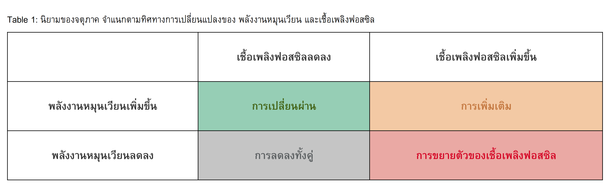
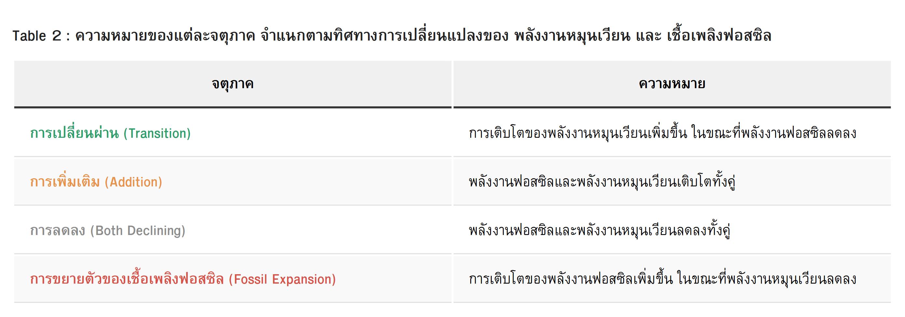
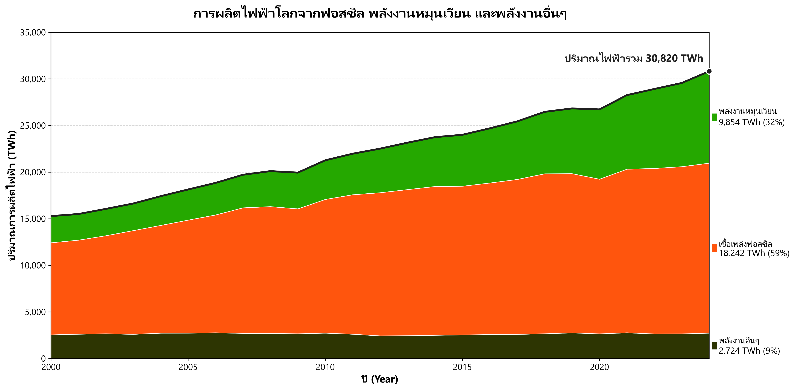
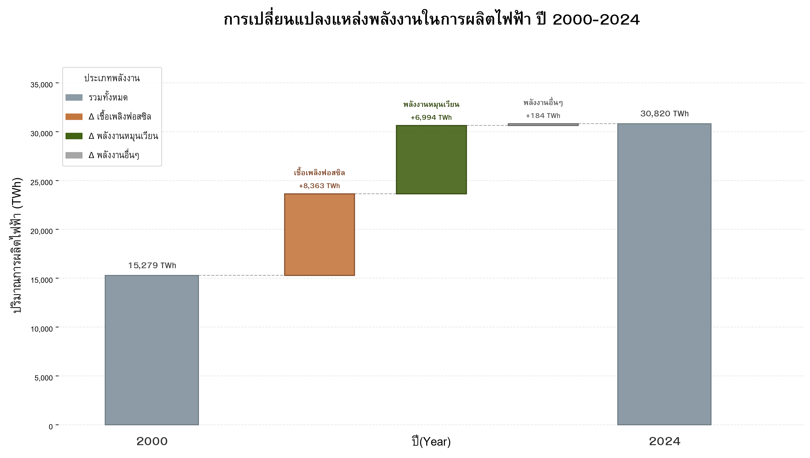
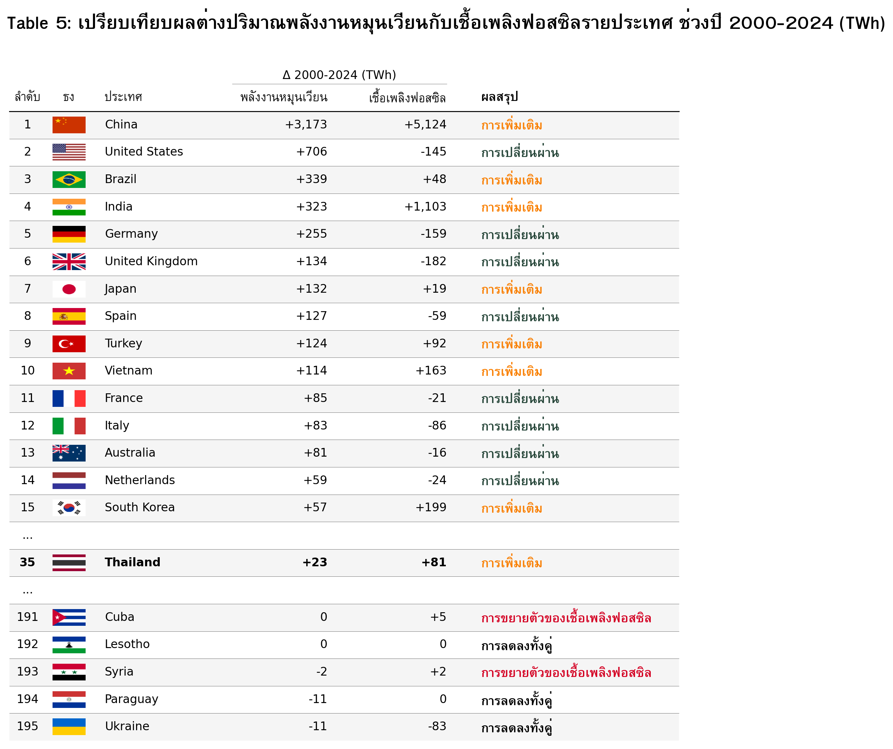

# Transition or Addition? 
ถอดรหัสความจริงเบื้องหลังการเติบโตของระบบไฟฟ้าโลก

โปรเจกต์วิเคราะห์ข้อมูลการผลิตไฟฟ้าโลก ปี 2000–2024 เพื่อตอบคำถาม: **พลังงานหมุนเวียนกำลังเข้ามาเปลี่ยนผ่านเชื้อเพลิงฟอสซิล (Transition) หรือแค่เพิ่มเติมเข้าระบบเพื่อรองรับความต้องการที่โตขึ้น (Addition)?**

คำถามนี้สำคัญเพราะการที่พลังงานหมุนเวียนเติบโต ไม่ได้หมายความว่า เชื้อเพลิงฟอสซิลจะลดลงเสมอไป หากพลังงานหมุนเวียนเพิ่มขึ้น พร้อมกับเชื้อเพลิงฟอสซิลที่ยังเพิ่มขึ้น ระบบอาจกำลังอยู่ในลักษณะ **Addition** คือการเพิ่มกำลังผลิตเพื่อรองรับความต้องการไฟฟ้าที่เติบโตขึ้น ขณะที่ **Transition** ในกรอบของโปรเจกต์นี้ หมายถึง พลังงานหมุนเวียนเพิ่มขึ้นในขณะที่เชื้อเพลิงฟอสซิลลดลง

ดังนั้น โปรเจกต์นี้ไม่ได้มองเพียงว่า พลังงานหมุนเวียนโตขึ้นหรือไม่ แต่พิจารณาการเปลี่ยนแปลงของพลังงานหมุนเวียนและเชื้อเพลิงฟอสซิลพร้อมกัน และมองทั้งภาพรวมระยะยาวและแนวโน้มในแต่ละช่วงเวลา เพื่อดูว่า Energy Transition กำลังเกิดขึ้นในลักษณะใด และเกิดขึ้นที่ไหนบ้าง

✨ **คำย่อที่ใช้ในโปรเจคนี้:** TWh (เทระวัตต์ชั่วโมง) หน่วยวัดปริมาณไฟฟ้า | Δ (Delta) ผลต่างของพลังงาน

---
## สารบัญ (Table of Contents)
- ▤ [ที่มาของคำถาม](#background)
- ▤ [ข้อมูลและขอบเขตการวิเคราะห์](#data-scope)
    - [Dataset Schema](#dataset-schema)
- ✎ [นิยาม: Transition vs Addition](#definitions)
- ✎ [วิเคราะห์ข้อมูลภาพรวมทั่วโลก](#global-overview)
- ✎ [5-Year Rolling Window: มองแนวโน้ม](#rolling-window)
- ✎ [วิเคราะห์ข้อมูลระดับภูมิภาค](#regional)
- ✎ [วิเคราะห์ข้อมูลระดับประเทศ](#country-level)
- ✎ [Insight และข้อเสนอแนะ](#insights)
- ✎ [บทสรุป](#summary)
- ◆ [Repository Structure](#repo-structure)
- ◆ [How to Run / Reproduce](#how-to-run)
- ◆ [ทีมงานและเครดิต](#credits)

---
<a id="background"></a>
## 📝 ที่มาของคำถาม

พลังงานหมุนเวียนเติบโตต่อเนื่องทั่วโลก ทั้งแสงอาทิตย์ ลม และน้ำ หลายคนจึงคิดว่าโลกกำลังเข้าสู่ **"การเปลี่ยนผ่านพลังงาน" (Energy Transition) เต็มตัวแล้ว** แต่การที่พลังงานหมุนเวียนเพิ่มขึ้นเพียงอย่างเดียว อาจยังไม่เพียงพอที่จะบอกว่าเกิดการเปลี่ยนผ่าน เพราะสิ่งที่น่าสนใจคือ พลังงานหมุนเวียนที่เพิ่มขึ้น กำลังเข้ามาแทนที่การผลิตไฟฟ้าจากเชื้อเพลิงฟอสซิล หรือกำลังเพิ่มเข้ามาเพื่อรองรับการผลิตไฟฟ้าที่มากขึ้น?

จึงเกิดเป็นคำถามหลักของโปรเจกต์นี้ว่า

**การเติบโตของพลังงานหมุนเวียนทั่วโลกกำลังเป็น “Transition” หรือ “Addition”?**

โดยโปรเจกต์กำหนดให้ **Transition** คือกรณีที่การผลิตไฟฟ้าจากพลังงานหมุนเวียนเพิ่มขึ้น ขณะที่การผลิตไฟฟ้าจากเชื้อเพลิงฟอสซิลลดลง ส่วน **Addition** คือกรณีที่การผลิตไฟฟ้าจากทั้งสองแหล่งเพิ่มขึ้นพร้อมกัน

เพื่อหาคำตอบ โปรเจกต์จึงใช้ข้อมูลการผลิตไฟฟ้าของโลกและรายประเทศในช่วง ปี 2000–2024 เพื่อดูว่า เมื่อพลังงานหมุนเวียนเติบโตขึ้น การผลิตไฟฟ้าจากเชื้อเพลิงฟอสซิลมีการเปลี่ยนแปลงไปในทิศทางใด

---
<a id="data-scope"></a>
## 📝 ข้อมูลและขอบเขตการวิเคราะห์ 

| | |
|---|---|
| **ชุดข้อมูล** | Electricity Generation by Country and Source (2000–2025) |
| **แหล่งที่มา** | Our World in Data / Ember Climate |
| **ความครอบคลุม** | ข้อมูลระดับประเทศมากกว่า 190 ประเทศ แยกตาม เชื้อเพลิงฟอสซิล, พลังงานหมุนเวียน และนิวเคลียร์ |
| **ตัวชี้วัดหลัก** | ปริมาณผลิตไฟฟ้า (TWh) และสัดส่วนต่อยอดผลิตรวม (%) |

✨ **ขอบเขต:** ดูเฉพาะภาคการผลิตไฟฟ้า ไม่รวมภาคขนส่งหรือการเผาเชื้อเพลิงโดยตรงในโรงงาน เพราะเป็นจุดที่ พลังงานหมุนเวียน กับ เชื้อเพลิงฟอสซิล ป้อนไฟฟ้าเข้าระบบเดียวกันโดยตรง ผลสรุปในเอกสารนี้จึงสะท้อนเฉพาะระบบผลิตไฟฟ้าเท่านั้น

<a id="dataset-schema"></a>
### 📋 Dataset Schema

ไฟล์ข้อมูลที่ใช้จริงในการวิเคราะห์คือ `renewable_energy_countries_selected_v7.csv` (ผลลัพธ์จากขั้นตอน Data Cleaning) มีขนาด **5,381 แถว × 23 คอลัมน์** ครอบคลุม **213 ประเทศ** ปี 2000–2025 คอลัมน์หลักที่ใช้ในการวิเคราะห์มีดังนี้:

| คอลัมน์ | คำอธิบาย |
|---|---|
| `country` | ชื่อประเทศ |
| `continent` | ทวีปที่ประเทศตั้งอยู่ (เพิ่มเข้ามาจากการจับคู่ ISO code กับตารางทวีป) |
| `year` | ปี (2000–2025) |
| `iso_code` | รหัสประเทศ ISO 3 ตัวอักษร |
| `electricity_generation` | ปริมาณไฟฟ้าที่ผลิตได้ทั้งหมดของประเทศนั้น (TWh) |
| `renewables_share_elec` | สัดส่วนพลังงานหมุนเวียนต่อไฟฟ้าที่ผลิตทั้งหมด (%) |
| `fossil_share_elec` | สัดส่วนเชื้อเพลิงฟอสซิลต่อไฟฟ้าที่ผลิตทั้งหมด (%) |
| `low_carbon_share_elec` | สัดส่วนพลังงานคาร์บอนต่ำ (หมุนเวียน + นิวเคลียร์) (%) |
| `solar_electricity` / `wind_electricity` / `hydro_electricity` | ปริมาณไฟฟ้าที่ผลิตจากแสงอาทิตย์ / ลม / น้ำ (TWh) |
| `nuclear_electricity` / `coal_electricity` / `gas_electricity` / `oil_electricity` | ปริมาณไฟฟ้าที่ผลิตจากนิวเคลียร์ / ถ่านหิน / ก๊าซ / น้ำมัน (TWh) |
| `other_renewable_electricity` | ปริมาณไฟฟ้าจากพลังงานหมุนเวียนอื่น ๆ เช่น ชีวมวล (TWh) |
| `solar_share_elec` ... `gas_share_elec` | สัดส่วนของแต่ละแหล่งพลังงานต่อไฟฟ้าที่ผลิตทั้งหมด (%) |

*หมายเหตุ: การวิเคราะห์เชิงเปรียบเทียบในหัวข้อ "ภาพรวมโลก" ถึง "ระดับประเทศ" ใช้ข้อมูลถึงปี 2024 เท่านั้น เนื่องจากข้อมูลปี 2025 ยังไม่ครบทุกประเทศ*

---
<a id="definitions"></a>
## ✎ นิยาม: Transition vs Addition

แบ่งการเปลี่ยนแปลงเป็น 4 แบบ ตามทิศทางของพลังงานหมุนเวียน และเชื้อเพลิงฟอสซิลในช่วงเวลาเดียวกัน

**Table 1: นิยาม 4 กรณี Transition / Addition / Decline / Fossil Expansion (Quadrant Definition Matrix)**



- ตารางที่ 1: เกณฑ์การจำแนกรูปแบบการเปลี่ยนแปลงของระบบไฟฟ้าออกเป็น 4 กรณี ตามทิศทางของพลังงานหมุนเวียนและเชื้อเพลิงฟอสซิล (แสดงเป็นตาราง 2×2 ไม่มีตัวเลข ตารางนี้เป็นเกณฑ์อ้างอิงหลักที่ใช้จำแนกประเทศทั้งหมดในทุกส่วนถัดไปของการวิเคราะห์)

---
**Table 2: ความหมายของประเภทการเปลี่ยนแปลงตามเกณฑ์การจำแนก (Quadrant Meaning Description)**



- ตารางที่ 2: ความหมายของแต่ละกรณีในตารางที่ 1 อธิบายเป็นข้อความเต็ม (แสดงคำอธิบายทิศทางของพลังงานหมุนเวียนและเชื้อเพลิงฟอสซิลในแต่ละกรณี ตารางนี้ทำให้ผู้อ่านเข้าใจความหมายของคำว่า Transition, Addition, Decline และ Fossil Expansion ได้ทันทีโดยไม่ต้องตีความจากตัวเลขเอง)

📑 นิยามนี้เป็นเกณฑ์หลักที่ใช้ในการจำแนกและตีความผลการวิเคราะห์ในทุกระดับ ตั้งแต่ระดับโลก ระดับภูมิภาค จนถึงระดับประเทศ

---
<a id="global-overview"></a>
## ✎ วิเคราะห์ข้อมูลภาพรวมทั่วโลก

ตั้งแต่ปี 2000 การผลิตไฟฟ้าจากพลังงานหมุนเวียนของโลกมีแนวโน้มเพิ่มขึ้นอย่างต่อเนื่อง สะท้อนถึงการขยายตัวของแหล่งพลังงานหมุนเวียนในระบบไฟฟ้าโลก

**Figure 1: พลังงานหมุนเวียนโตต่อเนื่อง (Renewable Energy Growth Over Time)**


- ภาพที่ 1: แนวโน้มปริมาณการผลิตไฟฟ้าจากพลังงานหมุนเวียนทั่วโลก ปี 2000–2024 (แสดงปริมาณไฟฟ้าสะสมจากแสงอาทิตย์ ลม และน้ำ หน่วย TWh ในแต่ละปี ผลลัพธ์ยืนยันว่าพลังงานหมุนเวียนเติบโตขึ้นอย่างต่อเนื่องตลอด 24 ปีที่ผ่านมา)

🌟 อย่างไรก็ตาม การเพิ่มขึ้นของพลังงานหมุนเวียนเพียงอย่างเดียวไม่เพียงพอที่จะสรุปว่า ระบบไฟฟ้ากำลังเกิดการเปลี่ยนผ่าน จากเชื้อเพลิงฟอสซิล  เนื่องจากต้องพิจารณาควบคู่กันว่าปริมาณเชื้อเพลิงฟอสซิลมีแนวโน้มลดลงหรือไม่?

---
**Figure 2: ฟอสซิลกับพลังงานหมุนเวียนเติบโตไปพร้อมกัน (Fossil vs Renewable Generation)**



- ภาพที่ 2: ปริมาณการผลิตไฟฟ้ารายปีจากเชื้อเพลิงฟอสซิลเทียบกับพลังงานหมุนเวียน ปี 2000–2024 (แสดงเป็น Stacked Area วางซ้อนกันในแต่ละปีเพื่อดูยอดรวมของปีนั้น หน่วย TWh ผลลัพธ์แสดงว่าเชื้อเพลิงฟอสซิลไม่ได้ลดลงเลย แต่กลับเพิ่มขึ้นควบคู่ไปกับพลังงานหมุนเวียนตลอดทั้งช่วง)

**ข้อสรุปสำคัญ (Key Takeaways):** ตลอดช่วง 24 ปีที่ผ่านมา การผลิตไฟฟ้ารวมของโลกมีการเพิ่มขึ้นอย่างต่อเนื่อง ขณะที่การผลิตไฟฟ้าจากเชื้อเพลิงฟอสซิลไม่ได้ลดลงตามการขยายตัวของพลังงานหมุนเวียน แต่ยังคงเพิ่มขึ้นควบคู่กัน แม้ว่าพลังงานหมุนเวียนจะมีสัดส่วนในการผลิตไฟฟ้ารวมเพิ่มขึ้นอย่างชัดเจนในช่วงหลัง

---
**Figure 3: ฟอสซิลโตมากกว่าพลังงานหมุนเวียน (Incremental Growth Comparison, 2000→2024)**



- ภาพที่ 3: ส่วนต่างของปริมาณไฟฟ้าที่เพิ่มขึ้นจากเชื้อเพลิงฟอสซิลและพลังงานหมุนเวียน ระหว่างปี 2000 กับ 2024 (แสดงเป็นกราฟ Waterfall หน่วย TWh ผลลัพธ์ชี้ว่าเชื้อเพลิงฟอสซิลได้รับส่วนแบ่งของการเติบโตมากกว่า คือเพิ่มขึ้น +8,363 TWh เทียบกับพลังงานหมุนเวียนที่เพิ่มขึ้น +6,994 TWh)

**ข้อสรุปสำคัญ (Key Takeaways):** การผลิตไฟฟ้ารวมของโลกเพิ่มขึ้นเกือบสองเท่าภายใน 24 ปี จาก 15,279 เป็น 30,820 TWh และในส่วนที่เพิ่มขึ้นทั้งหมด **เชื้อเพลิงฟอสซิลถูกผลิตเพิ่มมากกว่า พลังงานหมุนเวียน** (+8,363 เทียบ +6,994 TWh) พูดง่าย ๆ คือ ในภาพรวมตลอดปี 2000–2024 การเติบโตของพลังงานหมุนเวียนยังไม่ได้มาพร้อมกับการลดลงของเชื้อเพลิงฟอสซิลในระดับโลก และส่วนเพิ่มของเชื้อเพลิงฟอสซิลยังมีขนาดมากกว่าส่วนเพิ่มของพลังงานหมุนเวียน หากเทียบเฉพาะปี 2000 กับ 2024 ภาพรวมจึงมีลักษณะ **Addition** มากกว่า Transition ตามนิยามของโปรเจกต์

🌟 อย่างไรก็ตาม ตลอดหลายสิบปีที่ผ่านมา หลายประเทศทั่วโลกต่างรณรงค์และลงทุนกับพลังงานหมุนเวียนอย่างจริงจังไม่น้อย จึงเกิดคำถามว่าเหตุใดภาพรวมจึงยังปรากฏลักษณะ Addition อยู่ เป็นไปได้หรือไม่ว่าการพิจารณาเพียงจุดเริ่มต้น (ปี 2000) เทียบกับจุดปลาย (ปี 2024) กำลังกลบสัญญาณการเปลี่ยนแปลงบางอย่างที่เกิดขึ้น "ระหว่างทาง" ไว้ ดังนั้นจึงจำเป็นต้องพิจารณา "แนวโน้ม" ของการเติบโตในแต่ละช่วงเวลาเพิ่มเติม เพื่อดูว่าการขยายตัวของพลังงานหมุนเวียนและเชื้อเพลิงฟอสซิลเปลี่ยนแปลงไปอย่างไรในแต่ละช่วงเวลา

---
<a id="rolling-window"></a>
## ✎ 5-Year Rolling Window: มองแนวโน้ม

เทียบแค่จุดเริ่มกับจุดจบ อาจพลาดเรื่องราวระหว่างทาง จึงใช้เทคนิค **5-Year Rolling Window** ดูการเปลี่ยนแปลงทีละช่วง 5 ปีที่เลื่อนไปเรื่อย ๆ

**Figure 4: จุดเปลี่ยนปี 2016 พลังงานหมุนเวียนแซงฟอสซิล (5-Year Rolling Window: Share of New Generation)**


- ภาพที่ 4: สัดส่วนของเชื้อเพลิงฟอสซิลและพลังงานหมุนเวียนที่รองรับการเพิ่มขึ้นของไฟฟ้าใหม่ในแต่ละช่วง 5 ปี ปี 2005–2024 (แสดงเป็น % ของไฟฟ้าใหม่ในแต่ละช่วง ผลลัพธ์ชี้ว่าโครงสร้างการเติบโตเปลี่ยนจากพึ่งพาฟอสซิลเป็นหลักในช่วงต้น มาเป็นพลังงานหมุนเวียนแซงหน้าตั้งแต่ปี 2016 และครองสัดส่วนถึง 71% ในปี 2024)

**ข้อสรุปสำคัญ (Key Takeaways):** ช่วงแรก (2005–2007) เชื้อเพลิงฟอสซิลรองรับไฟฟ้าใหม่ถึง 80% ขึ้นไป พลังงานหมุนเวียนมีบทบาทน้อยกว่ามาก แต่สัดส่วนของเชื้อเพลิงฟอสซิลลดลงต่อเนื่อง ขณะที่พลังงานหมุนเวียนเพิ่มขึ้นเรื่อย ๆ

**จุดเปลี่ยนคือปี 2016** ปีแรกที่พลังงานหมุนเวียนรองรับไฟฟ้าใหม่ได้มากกว่าเชื้อเพลิงฟอสซิล ในปี 2024 ล่าสุด พลังงานหมุนเวียนรับบทบาทถึง **71%** ของไฟฟ้าที่เพิ่มขึ้นในช่วง 5 ปีล่าสุด ส่วนเชื้อเพลิงฟอสซิลเหลือ **29%**

ข้อมูลนี้ทำให้เห็นว่า ภาพรวม 24 ปีและภาพของช่วงล่าสุดไม่ได้ขัดแย้งกัน แต่กำลังเล่า **มิติใหม่จากข้อมูลเดียวกัน**
- ถ้ามอง **2000 → 2024**: เชื้อเพลิงฟอสซิลยังเพิ่มขึ้นมาก และภาพรวมยังใกล้เคียง Addition
- ถ้ามอง **ช่วง 5 ปีล่าสุด**: พลังงานหมุนเวียนกลายเป็นแหล่งพลังงานหลักที่รองรับไฟฟ้าใหม่ ขณะที่บทบาทของเชื้อเพลิงฟอสซิลในการรองรับไฟฟ้าใหม่ลดลงอย่างชัดเจน
**ยังสรุปไม่ได้ว่า** โลกเข้าสู่ Energy Transition สมบูรณ์แล้ว แต่ผลจาก Figure 4 ที่ใช้เทคนิค 5-Year Rolling Window เป็นสัญญาณชัดว่า **โครงสร้างของการเติบโตของระบบไฟฟ้ากำลังเปลี่ยนไป** โดยพลังงานหมุนเวียนมีบทบาทมากขึ้นในการรองรับไฟฟ้าใหม่

💡 ผลลัพธ์นี้แสดงว่าสัญญาณของการ **"เปลี่ยนผ่าน"** ที่กำลังพิจารณาอยู่นั้นมีอยู่จริง มิใช่เพียงความคาดหวังที่ปราศจากหลักฐานรองรับ 

อย่างไรก็ตาม ผลจากการวิเคราาะห์แนวโน้มเป็นช่วง 5 ปี เป็นภาพรวมของทั้งโลก จึงยังไม่สามารถบอกได้ว่าแนวโน้มดังกล่าวเกิดขึ้นในประเทศส่วนใหญ่ หรือเกิดจากการเปลี่ยนแปลงของบางประเทศที่มีขนาดระบบไฟฟ้าขนาดใหญ่ 

คำถามถัดไปจึงไม่ใช่เพียงว่า “โลกกำลังเปลี่ยนไปอย่างไร” แต่คือ “การเปลี่ยนแปลงนี้เกิดขึ้นที่ไหน?” หากพลังงานหมุนเวียนมีบทบาทเพิ่มขึ้นในการรองรับไฟฟ้าใหม่ในระดับโลก เราจำเป็นต้องตรวจสอบต่อว่า รูปแบบดังกล่าวกระจายตัวไปในทิศทางเดียวกันในแต่ละประเทศหรือไม่ และเมื่อมองในระดับภูมิภาค จะพบรูปแบบที่แตกต่างกันหรือไม่?

---
<a id="regional"></a>
## ✎ วิเคราะห์ข้อมูลระดับภูมิภาค

**Figure 5: จำแนกประเทศทั่วโลก Transition vs Addition (Global Country Classification)**


- ภาพที่ 5: การจำแนกประเทศตามผลต่างปริมาณไฟฟ้าจากเชื้อเพลิงฟอสซิล (แกน X) เทียบกับพลังงานหมุนเวียน (แกน Y) ปี 2000–2024 หน่วย TWh ทั้งสองแกน (ใช้สเกล symlog เพื่อให้เห็นทั้งประเทศเล็กและประเทศใหญ่อย่างจีนในกราฟเดียวกันได้) ขนาดฟองแทนปริมาณไฟฟ้ารวมของประเทศในปี 2024 สีฟองแยกตามทวีป (ดู legend ในภาพ) และพื้นหลังแบ่งเป็น 4 โซนตามนิยามในตารางที่ 1 คือ สีเขียวอ่อน = Transition, สีส้มอ่อน = Addition, สีเทา = Decline, สีแดงอ่อน = Fossil Expansion

**ข้อสรุปสำคัญ (Key Takeaways):** เมื่อพิจารณาการกระจายตัวของประเทศในภาพที่ 5 พบว่า รูปแบบการเปลี่ยนแปลงของระบบไฟฟ้าไม่ได้เกิดขึ้นในทิศทางเดียวกันทั่วโลก ประเทศจำนวนมากที่มีการเติบโตของปริมาณไฟฟ้า มีแนวโน้มอยู่ในกลุ่ม **Addition**  ในขณะเดียวกัน ยังพบประเทศอีกกลุ่มหนึ่งที่มีรูปแบบที่ตรงกับนิยาม **Transition** ของโปรเจกต์

ดังนั้น ภาพที่ 5 แสดงให้เห็นจึงไม่ใช่เพียงว่าประเทศใดมีพลังงานหมุนเวียนเพิ่มขึ้นมากที่สุด แต่ช่วยให้เห็นว่า **การเติบโตของพลังงานหมุนเวียนเกิดขึ้นภายใต้บริบทของระบบไฟฟ้าที่แตกต่างกัน** บางประเทศกำลังเพิ่มพลังงานใหม่เพื่อรองรับการเติบโตของระบบ ขณะที่บางประเทศมีการเพิ่มพลังงานหมุนเวียนพร้อมกับการลดลงของการผลิตไฟฟ้าจากเชื้อเพลิงฟอสซิล

---
**Figure 6: Transition vs Addition รายทวีป (Regional Breakdown by Continent)**


- ภาพที่ 6: การจำแนกประเทศด้วยเกณฑ์เดียวกับภาพที่ 5 แต่แบ่งการแสดงผลตามทวีป โดยประเทศทั้งหมดในโลกยังคงแสดงเป็นจุดสีจางเพื่อใช้เป็นบริบทในการเปรียบเทียบ และเมื่อลองพิจารณาในระดับภูมิภาค ความแตกต่างระหว่างประเทศมีความชัดเจนมากขึ้น โดยเฉพาะระหว่างเอเชีย แอฟริกา อเมริกาเหนือ และยุโรป

---
**Figure 7: สองทวีปที่ภาพพลิก อีกสี่ทวีปที่ภาพเข้มขึ้น (Country Count vs Δrenewable-Weighted by Continent)**


- ภาพที่ 7: สัดส่วนรูปแบบการเปลี่ยนแปลงของแต่ละทวีป ปี 2000–2024 แสดงทวีปละ 2 แท่ง แท่งจางคือสัดส่วนเมื่อนับจำนวนประเทศ (1 ประเทศ = 1 เสียง) แท่งทึบคือสัดส่วนเมื่อถ่วงตามขนาดการเติบโตของพลังงานหมุนเวียนจริง (Δrenewable, TWh) สีแสดงประเภทตามเกณฑ์ในตารางที่ 1 และ n คือจำนวนประเทศในแต่ละทวีป

**ข้อสรุปสำคัญ (Key Takeaways):** เมื่อถ่วงน้ำหนักตามขนาดการเติบโตของพลังงานหมุนเวียนจริง (Δrenewable) พบสองรูปแบบที่ต่างกันชัดเจน

- **กลุ่มที่ 1 — ทิศทางพลิกกลับ:** ใน **อเมริกาเหนือ** และ **โอเชียเนีย** ประเทศส่วนใหญ่ (โดยจำนวน) อยู่ในกลุ่ม Addition (59% และ 71%) แต่เมื่อถ่วงน้ำหนักแล้ว **Transition กลับครองเกิน 90%** ของทั้งทวีป (93% และ 99%) เพราะมีประเทศขนาดใหญ่เพียง 1-2 ประเทศที่มีขนาดการเติบโตของพลังงานหมุนเวียนมากกว่าประเทศ Addition เล็ก ๆ ในทวีปเดียวกันรวมกันทั้งหมด
- **กลุ่มที่ 2 — ทิศทางเดียวกัน แค่เข้มขึ้น:** ใน **เอเชีย แอฟริกา อเมริกาใต้ และยุโรป** ทั้งการนับหัวและการถ่วงน้ำหนักชี้ไปทางเดียวกัน เพียงแต่การถ่วงน้ำหนักทำให้สัดส่วนเอียงแรงขึ้นไปอีก เช่น เอเชียมี Addition อยู่แล้ว 86% โดยนับหัว และขยับเป็น 100% เมื่อถ่วงน้ำหนัก สะท้อนว่าประเทศขนาดใหญ่ในทวีปเหล่านี้เดินไปในทิศทางเดียวกับประเทศส่วนใหญ่อยู่แล้ว ไม่ได้ฝืนแนวโน้มของทวีป
ดังนั้น อิทธิพลของประเทศขนาดใหญ่ไม่ได้ทำให้ผลของทุกทวีป "พลิก" เสมอไป แต่ขึ้นอยู่กับว่าประเทศใหญ่นั้นบังเอิญอยู่ฝั่งเดียวกับเสียงข้างมากหรือไม่ ในกรณีที่ไม่อยู่ฝั่งเดียวกัน (อเมริกาเหนือ, โอเชียเนีย) ขนาดจะเป็นตัวชนะเสมอ

> 📑 **หมายเหตุ:** ภาพนี้ถ่วงน้ำหนักด้วย Δrenewable เพียงแกนเดียว ไม่ได้ถ่วงด้วย Δfossil คู่กัน เนื่องจากตามนิยามในตารางที่ 1 การเพิ่มขึ้นของพลังงานหมุนเวียน (Δren ≥ 0) เกิดขึ้นได้เฉพาะในกลุ่ม Transition และ Addition เท่านั้น จึงเป็นแกนที่ตรงกับคำถามของภาพนี้พอดี คือ "การเติบโตของพลังงานหมุนเวียนจริงกระจุกอยู่ในประเทศกลุ่มไหน" ส่วนคำถามว่าฟอสซิลไปเพิ่มหรือลดที่ไหน ได้ตอบแล้วในภาพรวมระดับโลก (ภาพที่ 2-3) และการจัดกลุ่ม Transition/Addition ที่ใช้ในภาพนี้ก็คำนวณจากทั้งสองแกนอยู่แล้ว การเพิ่มแกน Δfossil เข้ามาถ่วงอีกชุดจะทำให้ต้องมีแท่งเพิ่มอีกเท่าตัวโดยไม่ได้เปลี่ยนข้อสรุปหลักของภาพนี้

🌟 ยิ่งไปกว่านั้น ภาพที่ 7 ชี้ว่าอิทธิพลของประเทศขนาดใหญ่ไม่ได้ส่งผลเหมือนกันทุกทวีป ใน **อเมริกาเหนือและโอเชียเนีย** ประเทศขนาดใหญ่เพียง 1-2 ประเทศพลิกผลของทั้งทวีปให้ต่างจากเสียงข้างมาก ขณะที่ทวีปอื่นประเทศขนาดใหญ่เดินไปทางเดียวกับประเทศส่วนใหญ่อยู่แล้ว คำถามจึงขยับไปเป็น **"ประเทศใดคือตัวขับเคลื่อนหลักของแต่ละทวีป และประเทศเหล่านั้นเทียบกับประเทศอื่นทั่วโลกอย่างไร"** ซึ่งจะตอบต่อในการวิเคราะห์ระดับประเทศด้านล่าง

---
<a id="country-level"></a>
## ✎ วิเคราะห์ข้อมูลระดับประเทศ
จากคำถามข้างต้น หัวข้อนี้จัดอันดับประเทศตามผลต่างการผลิตไฟฟ้าระหว่างปี 2000–2024 สองด้านคู่กัน คือด้าน**พลังงานหมุนเวียน** (ตารางที่ 3) และด้าน**เชื้อเพลิงฟอสซิล** (ตารางที่ 4) การวางสองตารางนี้คู่กันช่วยให้เห็นได้ทันทีว่า ประเทศที่เพิ่มพลังงานหมุนเวียนมากที่สุด เป็นประเทศเดียวกับที่เพิ่มเชื้อเพลิงฟอสซิลมากที่สุดหรือไม่ ซึ่งเป็นคำถามหลักที่ตัดสินว่าประเทศนั้นเข้าเกณฑ์ Transition หรือ Addition ตามนิยามในตารางที่ 1

**Table 3: 10 อันดับประเทศที่เพิ่มพลังงานหมุนเวียนมากที่สุด (Top Countries by Renewable Growth)**

**Table 4: 10 อันดับประเทศที่เพิ่มเชื้อเพลิงฟอสซิลมากที่สุด (Top Countries by Fossil Growth)**


- ตารางที่ 3-4: จัดอันดับประเทศตามผลต่างของการผลิตไฟฟ้าจากพลังงานหมุนเวียนและเชื้อเพลิงฟอสซิลระหว่างปี 2000–2024 ตามลำดับ หน่วย TWh โดยแสดง 15 อันดับแรก อันดับของประเทศไทย และ 5 อันดับสุดท้ายของแต่ละด้าน

**ข้อสรุปสำคัญ (Key Takeaways):** เมื่อเทียบสองตารางคู่กัน พบว่าประเทศอันดับ 1 ของทั้งสองด้านคือประเทศเดียวกัน ได้แก่ **จีน** ซึ่งเพิ่มพลังงานหมุนเวียนมากที่สุด (+3,173 TWh) และเพิ่มเชื้อเพลิงฟอสซิลมากที่สุดในโลกเช่นกัน (+5,124 TWh) เช่นเดียวกับ**อินเดีย**ที่ติดอันดับต้นทั้งสองด้าน (+323 และ +1,103 TWh ตามลำดับ) สะท้อนว่าสำหรับจีนและอินเดีย การเพิ่มพลังงานหมุนเวียนไม่ได้มาแทนที่เชื้อเพลิงฟอสซิล แต่เพิ่มเข้ามาควบคู่กัน ซึ่งเข้าเกณฑ์ **Addition** ตามนิยามของโปรเจกต์

ในทางกลับกัน **สหรัฐอเมริกา**ติดอันดับต้นของ Table 3 (+706 TWh) แต่ไม่ติดอันดับต้นของ Table 4 สะท้อนว่าการเพิ่มพลังงานหมุนเวียนของสหรัฐฯ ไม่ได้มาพร้อมการเพิ่มเชื้อเพลิงฟอสซิลในระดับเดียวกัน ซึ่งเป็นสัญญาณเริ่มต้นของรูปแบบ **Transition** ที่จะเห็นภาพชัดขึ้นเมื่อนำทั้งสองด้านมาพิจารณาพร้อมกันในตารางที่ 5

---
**Table 5: สรุปผล Transition/Addition รายประเทศ (Country-Level Verdict Summary)**



- ตารางที่ 5: เปรียบเทียบผลต่างการผลิตไฟฟ้าจากพลังงานหมุนเวียนและเชื้อเพลิงฟอสซิลในแต่ละประเทศ พร้อมจำแนกรูปแบบตามเกณฑ์ Transition / Addition ที่กำหนดไว้ในตารางที่ 1

เมื่อนำการเปลี่ยนแปลงของพลังงานหมุนเวียนและเชื้อเพลิงฟอสซิลมาพิจารณาร่วมกัน สามารถเห็นความแตกต่างระหว่างประเทศได้ชัดเจนขึ้น

**ข้อสรุปสำคัญ (Key Takeaways):** ประเทศในกลุ่ม **Addition** (สีส้มในตาราง) เป็นประเทศที่การผลิตไฟฟ้าจากพลังงานหมุนเวียนเพิ่มขึ้น ขณะที่การผลิตไฟฟ้าจากเชื้อเพลิงฟอสซิลก็เพิ่มขึ้นเช่นกัน ตัวอย่างที่ชัดเจน ได้แก่ **จีนและอินเดีย**
โดย**จีน**มีการเพิ่มขึ้นของ**พลังงานหมุนเวียนประมาณ +3,173 TWh และเชื้อเพลิงฟอสซิลประมาณ +5,124 TWh** ขณะที่**อินเดีย**มีการเพิ่มขึ้นของ**พลังงานหมุนเวียนประมาณ +323 TWh และเชื้อเพลิงฟอสซิลประมาณ +1,103 TWh** นอกจากจีนและอินเดียแล้ว ยังพบรูปแบบดังกล่าวในประเทศอื่น ๆ เช่น **บราซิล ญี่ปุ่น ตุรกี เวียดนาม และเกาหลีใต้**

รูปแบบนี้แสดงให้เห็นว่า การขยายตัวของพลังงานหมุนเวียนสามารถเกิดขึ้นพร้อมกับการขยายตัวของเชื้อเพลิงฟอสซิลได้ โดยเฉพาะในประเทศที่มีการเพิ่มขึ้นของทั้งการผลิตไฟฟ้าจากพลังงานหมุนเวียนและเชื้อเพลิงฟอสซิลในช่วงที่ศึกษา

ในอีกด้านหนึ่ง กลุ่ม **Transition** (สีเขียวในตาราง)  ประกอบด้วยประเทศที่การผลิตไฟฟ้าจากพลังงานหมุนเวียนเพิ่มขึ้น ในขณะที่การผลิตไฟฟ้าจากเชื้อเพลิงฟอสซิลลดลงตามเกณฑ์ของโปรเจกต์ ตัวอย่างเช่น **สหรัฐอเมริกา**มีการเพิ่มขึ้นของ**พลังงานหมุนเวียนประมาณ +706 TWh ขณะที่เชื้อเพลิงฟอสซิลลดลงประมาณ −145 TWh** **เยอรมนี**มีการเพิ่มขึ้นของ**พลังงานหมุนเวียนประมาณ +255 TWh และเชื้อเพลิงฟอสซิลลดลงประมาณ −159 TWh** ขณะที่ **สหราชอาณาจักร**มีการเพิ่มขึ้นของ**พลังงานหมุนเวียนประมาณ +134 TWh และเชื้อเพลิงฟอสซิลลดลงประมาณ −182 TWh** นอกจากนี้ยังพบรูปแบบดังกล่าวในประเทศอื่นๆ เช่น **สเปน ฝรั่งเศส อิตาลี ออสเตรเลีย และเนเธอร์แลนด์**

เมื่อเปรียบเทียบทั้งสองกลุ่ม จะเห็นได้ว่าการเติบโตของพลังงานหมุนเวียนมีความหมายแตกต่างกันตามบริบทของแต่ละประเทศ หากพลังงานหมุนเวียนเพิ่มขึ้นพร้อมกับเชื้อเพลิงฟอสซิลที่เพิ่มขึ้น รูปแบบดังกล่าวจะสอดคล้องกับ Addition ขณะที่หากพลังงานหมุนเวียนเพิ่มขึ้นพร้อมกับเชื้อเพลิงฟอสซิลที่ลดลง จะสอดคล้องกับ Transition ตามเกณฑ์ของโปรเจกต์นี้

---
**Figure 8: ประเทศที่อยู่ในกลุ่ม Transition อยู่ที่ไหน (World Map of Transition Pattern)**


- ภาพที่ 8: แผนที่โลกแสดงปริมาณพลังงานหมุนเวียนที่เพิ่มขึ้นเฉพาะประเทศที่เข้าเกณฑ์ Transition ระหว่างปี 2000–2024 โดยระดับสีแสดงปริมาณการเพิ่มขึ้นของการผลิตไฟฟ้าจากพลังงานหมุนเวียน หน่วย TWh (log scale)

เมื่อแสดงผลในรูปแบบแผนที่ จะเห็นว่าประเทศที่มีรูปแบบ Transition ตามเกณฑ์ของโปรเจกต์กระจายอยู่ในหลายภูมิภาค แต่มีความโดดเด่นในกลุ่มประเทศพัฒนาแล้วบางส่วน

**ข้อสรุปสำคัญ (Key Takeaways):** ประเทศตัวอย่างที่อยู่ในกลุ่ม **Transition** ได้แก่ **สหรัฐฯ เยอรมนี และสหราชอาณาจักร** โดยในช่วงปี 2000–2024 ประเทศเหล่านี้มีการผลิตไฟฟ้าจากพลังงานหมุนเวียนเพิ่มขึ้น ขณะที่การผลิตไฟฟ้าจากเชื้อเพลิงฟอสซิลลดลงตามเกณฑ์ของโปรเจกต์ ผลดังกล่าวแสดงให้เห็นว่า รูปแบบการเปลี่ยนแปลงของระบบไฟฟ้าไม่ได้เป็นไปในทิศทางเดียวกันทุกประเทศ และการที่ประเทศหนึ่งมีการเติบโตของพลังงานหมุนเวียน ไม่ได้หมายความว่าจะมีรูปแบบการเปลี่ยนแปลงของเชื้อเพลิงฟอสซิลเหมือนกัน

---
<a id="insights"></a>
## ✎ Insight และข้อเสนอแนะ

| Insight | So What | Action Plan |
|---|---|---|
| **ภาพรวมโลกในช่วง 2000–2024 ยังมีเชื้อเพลิงฟอสซิลเพิ่มขึ้นมากกว่าพลังงานหมุนเวียน** (เชื้อเพลิงฟอสซิล +8,363 vs พลังงานหมุนเวียน +6,994 TWh) | มองตลอดช่วง 24 ปี โลกยังไม่ได้อยู่ในภาพของการแทนที่เชื้อเพลิงฟอสซิลอย่างชัดเจน | เพิ่มพลังงานหมุนเวียนอย่างเดียวไม่พอ ต้องมีมาตรการลดการพึ่งพา/ปลดระวางโรงไฟฟ้าเชื้อเพลิงฟอสซิลควบคู่กัน เพื่อให้เกิดการเปลี่ยนแปลงของโครงสร้างระบบไฟฟ้า |
| **โครงสร้างการเติบโตของไฟฟ้าใหม่เปลี่ยนแปลงอย่างชัดเจนในช่วงหลัง** โดยตั้งแต่ปี 2016 พลังงานหมุนเวียนมีสัดส่วนในการรองรับไฟฟ้าใหม่มากกว่าเชื้อเพลิงฟอสซิล | แม้ภาพรวมระยะยาวยังพบการเพิ่มขึ้นของเชื้อเพลิงฟอสซิล แต่แหล่งพลังงานที่เข้ามารองรับการผลิตไฟฟ้าใหม่กำลังเปลี่ยนไป โดยพลังงานหมุนเวียนมีบทบาทเพิ่มขึ้นอย่างต่อเนื่อง | การขยายตัวของพลังงานหมุนเวียนควรดำเนินควบคู่กับการพัฒนาโครงข่ายไฟฟ้าและระบบกักเก็บพลังงาน เพื่อรองรับสัดส่วนพลังงานหมุนเวียนที่เพิ่มขึ้น |
| **จีนและอินเดียมีการเพิ่มขึ้นของทั้งพลังงานหมุนเวียนและเชื้อเพลิงฟอสซิล** | การเติบโตของพลังงานหมุนเวียนในประเทศที่มีการขยายตัวของระบบไฟฟ้าสูง ไม่ได้หมายความว่าเชื้อเพลิงฟอสซิลจะลดลงตามไปด้วย รูปแบบดังกล่าวจึงสะท้อนลักษณะ Addition ได้อย่างชัดเจน | ควรศึกษาความสัมพันธ์ระหว่างการเติบโตของความต้องการไฟฟ้า การเพิ่มขึ้นของพลังงานหมุนเวียน และการเปลี่ยนแปลงของการผลิตไฟฟ้าจากเชื้อเพลิงฟอสซิลเพิ่มเติม |
| **ประเทศที่อยู่ในกลุ่ม Transition หลายประเทศมีการเติบโตของการผลิตไฟฟ้าในปี 2024 ต่ำกว่าประเทศในกลุ่ม Addition** | ความแตกต่างดังกล่าวเป็นความสัมพันธ์ที่น่าสนใจระหว่างรูปแบบการเติบโตของระบบไฟฟ้ากับ Transition / Addition แต่ข้อมูลชุดนี้ยังไม่เพียงพอที่จะระบุว่าการเติบโตของการผลิตไฟฟ้าที่ต่ำเป็นสาเหตุของ Transition | ควรศึกษาปัจจัยเพิ่มเติม เช่น อัตราการเติบโตของความต้องการไฟฟ้า การปลดระวางโรงไฟฟ้าฟอสซิล นโยบายพลังงาน โครงข่ายไฟฟ้า และปัจจัยทางเศรษฐกิจ เพื่อทำความเข้าใจความแตกต่างระหว่างประเทศให้ลึกขึ้น |

---
<a id="summary"></a>
## ✎ บทสรุป

กลับมาที่คำถามตั้งต้น — **พลังงานหมุนเวียนกำลังเข้ามาเปลี่ยนผ่านเชื้อเพลิงฟอสซิล (Transition) หรือแค่เพิ่มเติมเข้าระบบเพื่อรองรับความต้องการที่โตขึ้น (Addition)?**
คำตอบคือ **เกิดขึ้นทั้งสองรูปแบบ ขึ้นอยู่กับช่วงเวลาและระดับที่พิจารณา**

- **ระดับโลก:** 2000–2024 : เมื่อมองตลอดช่วง 24 ปี พบว่าทั้งการผลิตไฟฟ้าจากพลังงานหมุนเวียนและเชื้อเพลิงฟอสซิลเพิ่มขึ้น จึงมีลักษณะใกล้เคียงกับ Addition มากกว่า Transition
- **แนวโน้ม (5-Year Rolling Window):** แสดงให้เห็นว่าโครงสร้างของการเพิ่มขึ้นของระบบไฟฟ้าโลกเปลี่ยนแปลงไปตามเวลาในช่วงแรก โดยตั้งแต่ปี 2016 เป็นต้นมา พลังงานหมุนเวียนมีสัดส่วนในการรองรับการเพิ่มขึ้นของการผลิตไฟฟ้ามากกว่าเชื้อเพลิงฟอสซิล โดยช่วงล่าสุดมีสัดส่วนประมาณ 71% ขณะที่เชื้อเพลิงฟอสซิลอยู่ที่ประมาณ 29%
- **ระดับประเทศ:** เมื่อพิจารณาระดับประเทศ พบว่าประเทศต่าง ๆ มีรูปแบบการเปลี่ยนแปลงที่แตกต่างกัน ประเทศที่มีการเติบโตของระบบไฟฟ้าสูงอาจยังอยู่ในช่วงที่พลังงานหมุนเวียนเข้ามาเพิ่มเติมเพื่อรองรับความต้องการใหม่ ขณะที่บางประเทศมีรูปแบบที่พลังงานหมุนเวียนเพิ่มขึ้นพร้อมกับการลดลงของการผลิตไฟฟ้าจากเชื้อเพลิงฟอสซิล

ดังนั้น ภาพรวมที่ได้จึงไม่ใช่โลกที่กำลัง **“Transition ทั้งหมด”** หรือ **“ยังไม่ Transition”** แต่เป็นระบบไฟฟ้าที่กำลังเปลี่ยนแปลงไปในอัตราและรูปแบบที่แตกต่างกันในแต่ละประเทศ

🌟 **สรุปสั้นๆ:** พลังงานหมุนเวียนกำลังเติบโตอย่างชัดเจน และมีบทบาทเพิ่มขึ้นในการรองรับการผลิตไฟฟ้าใหม่ แต่การเติบโตของพลังงานหมุนเวียนไม่ได้หมายความว่าเชื้อเพลิงฟอสซิลกำลังลดลงเสมอไป
ดังนั้น การทำความเข้าใจ **Energy Transition** จึงจำเป็นต้องพิจารณาทั้งการเติบโตของพลังงานหมุนเวียน การเปลี่ยนแปลงของเชื้อเพลิงฟอสซิล และช่วงเวลาที่ใช้ในการมองการเปลี่ยนแปลงไปพร้อมกัน

---
<a id="repo-structure"></a>
## 📦 Repository Structure

```
Transition-or-Addition/
├── README.md                                       # เอกสารฉบับนี้
├── Cleaning_data.ipynb                             # ทำความสะอาดข้อมูลดิบ → สร้าง .csv สำหรับวิเคราะห์
├── Transition-or-Addtion.ipynb                     # โน้ตบุ๊กหลัก: สร้างกราฟและตารางทั้งหมด (Figure 1-7, Table 1-5)
├── export_table_image.py                           # ฟังก์ชันช่วยแปลงตาราง pandas เป็นรูปภาพ (ใช้โดยโน้ตบุ๊กหลัก)
├── renewable_energy_share_2000_2025.csv            # ข้อมูลต้นฉบับ (7,636 แถว)
├── renewable_energy_countries_selected_v7.csv      # ข้อมูลสะอาดที่ใช้วิเคราะห์จริง (5,381 แถว)
├── images/                                         # กราฟและตารางทั้งหมดที่ใช้ใน README (Figure 1-7, Table 1-5)
├── flags_final3/                                   # ไฟล์ธงประเทศที่ใช้ประกอบ Table 3-5 (รวมธงที่แก้เพิ่มเอง เช่น Taiwan)
├── fonts/                                          # ฟอนต์ไทย (Garuda) สำหรับเรนเดอร์ข้อความไทยในกราฟ/ตาราง
└── maps/                                           # ไฟล์ shapefile สำหรับวาดแผนที่โลกใน Figure 7
```

---
<a id="how-to-run"></a>
## 📦 How to Run / Reproduce

### 1. ติดตั้งไลบรารีที่จำเป็น

```bash
pip install pandas numpy matplotlib seaborn geopandas flagpy plottable pillow
```

### 2. ทำความสะอาดข้อมูล

ดาวน์โหลดไฟล์ต้นฉบับ `renewable_energy_share_2000_2025.csv` แล้วรัน `Cleaning_data.ipynb` ทั้งไฟล์ก่อน จะได้ไฟล์ `renewable_energy_countries_selected_v7.csv` ที่พร้อมใช้วิเคราะห์ หรือสามารถใช้ไฟล์ที่เตรียมพร้อมไว้แล้วก็ได้เช่นกัน

### 3. สร้างกราฟและตารางทั้งหมด

รัน `Transition-or-Addtion.ipynb` ทั้งไฟล์ (ต้องมีโฟลเดอร์ `flags_final3/`, `fonts/`, `maps/` และไฟล์ `export_table_image.py` อยู่ในโฟลเดอร์เดียวกัน) กราฟและตารางทั้งหมด (Figure 1-7, Table 1-5) จะถูกสร้างและบันทึกลงโฟลเดอร์ `images/` โดยอัตโนมัติ

> **หมายเหตุ:** เครื่องที่ใช้รันต้องมีฟอนต์ไทย Garuda ติดตั้งในระบบ (Ubuntu/Linux: `apt-get install fonts-thai-tlwg`) ไม่เช่นนั้นข้อความไทยในกราฟ/ตารางจะแสดงเป็นกล่องสี่เหลี่ยม (tofu) แทนตัวอักษร

---
<a id="credits"></a>
## 📦 ทีมงานและเครดิต

**กลุ่ม: OUT OF TOKEN**

**แหล่งข้อมูล:** Our World in Data / Ember Climate — Electricity Generation by Country and Source (2000–2025)

---
### หมายเหตุด้านข้อมูล

บทวิเคราะห์นี้ครอบคลุมเฉพาะภาคผลิตไฟฟ้า ไม่รวมภาคขนส่งหรือภาคอุตสาหกรรมที่เผาเชื้อเพลิงโดยตรง กราฟและตารางทั้งหมดสร้างขึ้นเองจากข้อมูลดิบ ไม่ได้คัดลอกภาพจากแหล่งอื่น
