# Transition or Addition?

ถอดรหัสความจริงเบื้องหลังการเติบโตของระบบไฟฟ้าโลก

โปรเจกต์วิเคราะห์ข้อมูลการผลิตไฟฟ้าโลก ปี 2000–2024 เพื่อตอบคำถาม: **พลังงานหมุนเวียนกำลังเข้ามาเปลี่ยนผ่านเชื้อเพลิงฟอสซิล (Transition) หรือแค่เพิ่มเติมเข้าระบบเพื่อรองรับความต้องการที่โตขึ้น (Addition)?**

คำถามนี้สำคัญเพราะการที่พลังงานหมุนเวียนเติบโต ไม่ได้หมายความว่า เชื้อเพลิงฟอสซิลจะลดลงเสมอไป หากพลังงานหมุนเวียนเพิ่มขึ้น พร้อมกับเชื้อเพลิงฟอสซิลที่ยังเพิ่มขึ้น ระบบอาจกำลังอยู่ในลักษณะ **Addition** คือการเพิ่มกำลังผลิตเพื่อรองรับความต้องการไฟฟ้าที่เติบโตขึ้น ขณะที่ **Transition** ในกรอบของโปรเจกต์นี้ หมายถึง พลังงานหมุนเวียนเพิ่มขึ้นในขณะที่เชื้อเพลิงฟอสซิลลดลง

ดังนั้น โปรเจกต์นี้ไม่ได้มองเพียงว่า พลังงานหมุนเวียนโตขึ้นหรือไม่ แต่พิจารณา **การเปลี่ยนแปลงของพลังงานหมุนเวียน และเชื้อเพลิงฟอสซิลพร้อมกัน** และมองทั้งภาพรวมระยะยาวและแนวโน้มในแต่ละช่วงเวลา เพื่อดูว่า Energy Transition กำลังเกิดขึ้นในลักษณะใด และเกิดขึ้นที่ไหนบ้าง

**คำย่อที่ใช้ในโปรเจคนี้:** TWh (เทระวัตต์ชั่วโมง) หน่วยวัดปริมาณไฟฟ้า | Δ (Delta) ผลต่างของพลังงาน

---
## สารบัญ (Table of Contents)

---
## คำถามวิจัย (Research Questions)

🌟  **พลังงานหมุนเวียนที่โตขึ้น กำลัง "เปลี่ยนผ่าน" จากเชื้อเพลิงฟอสซิล หรือแค่ "เพิ่มเติม" พลังงานเข้าระบบเพื่อรองรับความต้องการไฟฟ้าที่มากขึ้น?** คำถามนี้มีสองส่วน คือ เชื้อเพลิงฟอสซิลลดลงจริงหรือไม่ และถ้ายังไม่ลด เป็นเพราะต้องรองรับความต้องการที่โตขึ้นจริงหรือไม่?

| | คำถาม | ตอบในส่วน |
|---|---|---|
| **RQ1** | ในระดับโลกและระดับประเทศ ภาพนี้เป็นแบบไหน และแนวโน้มช่วงหลังเปลี่ยนไปหรือไม่? | 4–7 |
| **RQ2** | ความต้องการไฟฟ้าที่โตมาก หรือการสร้างพลังงานหมุนเวียนที่ช้า อย่างไหนสัมพันธ์กับการเป็น Addition มากกว่า? | 9 |

---

## ที่มาของคำถาม (Origins of a Research Question)

พลังงานหมุนเวียนเติบโตต่อเนื่องทั่วโลก ทั้งแสงอาทิตย์ ลม และน้ำ หลายคนจึงคิดว่าโลกกำลังเข้าสู่ "การเปลี่ยนผ่านพลังงาน" (Energy Transition) เต็มตัวแล้ว แต่คำถามที่แท้จริงคือ **พลังงานหมุนเวียนที่โตขึ้น กำลัง "เปลี่ยนผ่าน" จากเชื้อเพลิงฟอสซิล หรือแค่ "เพิ่มเติม" พลังงานเข้าระบบเพื่อรองรับความต้องการไฟฟ้าที่มากขึ้น?** คำถามนี้มีสองส่วน

- **เปลี่ยนผ่านหรือไม่:** ถ้าพลังงานหมุนเวียนเพิ่มขึ้น แต่เชื้อเพลิงฟอสซิลก็เพิ่มตาม นั่นยังไม่ใช่การเปลี่ยนผ่านตามนิยามของโปรเจกต์นี้ โปรเจกต์จึงใช้ข้อมูลการผลิตไฟฟ้าโลกปี 2000–2024 เพื่อดูว่า การเติบโตของพลังงานหมุนเวียน เกิดขึ้นพร้อมกับการลดลงของเชื้อเพลิงฟอสซิลหรือไม่
- **รองรับความต้องการหรือไม่:** ถ้าความต้องการไฟฟ้าเพิ่มขึ้น ส่วนที่พลังงานหมุนเวียนรองรับไม่ได้จะตกเป็นของแหล่งอื่น ซึ่งส่วนใหญ่คือเชื้อเพลิงฟอสซิล ดังนั้นถ้าเชื้อเพลิงฟอสซิลไม่ลด จึงมีคำอธิบายที่เป็นไปได้สองแบบ คือ **ความต้องการไฟฟ้าโตมาก** จนหมุนเวียนตามไม่ทัน หรือ **สร้างพลังงานหมุนเวียนได้ช้า**

---

## ข้อมูลและขอบเขตการวิเคราะห์ (Dataset and Scope of Analysis)

|                   |                                                                                             |
| ----------------- | ------------------------------------------------------------------------------------------- |
| **ชุดข้อมูล**     | Electricity Generation by Country and Source (2000–2025)                                    |
| **แหล่งที่มา**    | Our World in Data / Ember Climate                                                           |
| **ความครอบคลุม**  | ข้อมูลระดับประเทศมากกว่า 190 ประเทศ แยกตาม เชื้อเพลิงฟอสซิล, พลังงานหมุนเวียน และนิวเคลียร์ |
| **ตัวชี้วัดหลัก** | ปริมาณผลิตไฟฟ้า (TWh) และสัดส่วนต่อยอดผลิตรวม (%)                                           |
| **ช่วงวิเคราะห์** | 2000–2024                                                                                   |

**ขอบเขต:** ดูเฉพาะภาคการผลิตไฟฟ้า ไม่รวมภาคขนส่งหรือการเผาเชื้อเพลิงโดยตรงในโรงงาน เพราะเป็นจุดที่ พลังงานหมุนเวียน กับ เชื้อเพลิงฟอสซิล ป้อนไฟฟ้าเข้าระบบเดียวกันโดยตรง ผลสรุปในเอกสารนี้จึงสะท้อนเฉพาะระบบผลิตไฟฟ้าเท่านั้น

---

## นิยามของคำว่าการเปลี่ยนผ่านและการเพิ่มเติม (Definition of Transition and Addition)

แบ่งการเปลี่ยนแปลงเป็น 4 แบบ ตามทิศทางของพลังงานหมุนเวียน และเชื้อเพลิงฟอสซิลในช่วงเวลาเดียวกัน

**Table 1: นิยาม 4 กรณี Transition / Addition / Decline / Fossil Expansion (Quadrant Definition Matrix)**

**Table 2: ความหมายของประเภทการเปลี่ยนแปลงตามเกณฑ์การจำแนก (Quadrant Meaning Description)**

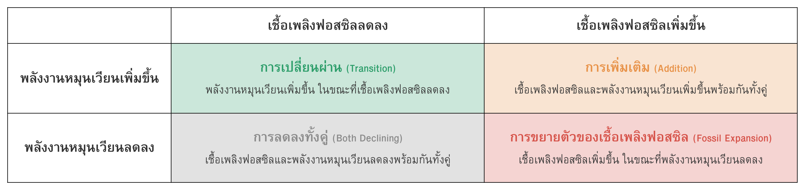

- ตารางที่ 1: เกณฑ์การจำแนกรูปแบบการเปลี่ยนแปลงของระบบไฟฟ้าออกเป็น 4 กรณี ตามทิศทางของพลังงานหมุนเวียนและเชื้อเพลิงฟอสซิล (แสดงเป็นตาราง 2×2 ไม่มีตัวเลข ตารางนี้เป็นเกณฑ์อ้างอิงหลักที่ใช้จำแนกประเทศทั้งหมดในทุกส่วนถัดไปของการวิเคราะห์)
- ตารางที่ 2: ความหมายของแต่ละกรณีในตารางที่ 1 อธิบายเป็นข้อความเต็ม (แสดงคำอธิบายทิศทางของพลังงานหมุนเวียนและเชื้อเพลิงฟอสซิลในแต่ละกรณี ตารางนี้ทำให้ผู้อ่านเข้าใจความหมายของคำว่า Transition, Addition, Decline และ Fossil Expansion ได้ทันทีโดยไม่ต้องตีความจากตัวเลขเอง)

📑 นิยามนี้เป็นเกณฑ์หลักที่ใช้ในการจำแนกและตีความผลการวิเคราะห์ในทุกระดับ ตั้งแต่ระดับโลก ระดับภูมิภาค จนถึงระดับประเทศ

---

## วิเคราะห์ข้อมูลภาพรวมทั่วโลก (Global Perspective)

ตั้งแต่ปี 2000 การผลิตไฟฟ้าจากพลังงานหมุนเวียนของโลกมีแนวโน้มเพิ่มขึ้นอย่างต่อเนื่อง สะท้อนถึงการขยายตัวของแหล่งพลังงานหมุนเวียนในระบบไฟฟ้าโลก

**Figure 1: พลังงานหมุนเวียนโตต่อเนื่อง (Renewable Energy Growth Over Time)**

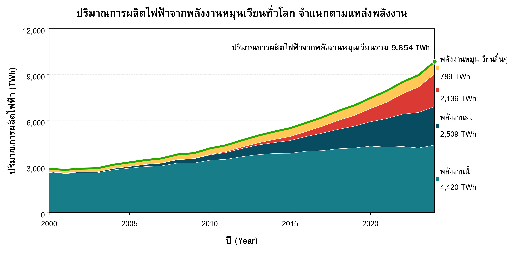

- ภาพที่ 1: แนวโน้มปริมาณการผลิตไฟฟ้าจากพลังงานหมุนเวียนทั่วโลก ปี 2000–2024 (แสดงปริมาณไฟฟ้าสะสมจากแสงอาทิตย์ ลม และน้ำ หน่วย TWh ในแต่ละปี ผลลัพธ์ยืนยันว่าพลังงานหมุนเวียนเติบโตขึ้นอย่างต่อเนื่องตลอด 24 ปีที่ผ่านมา)

🌟 อย่างไรก็ตาม การเพิ่มขึ้นของพลังงานหมุนเวียนเพียงอย่างเดียวไม่เพียงพอที่จะสรุปว่า ระบบไฟฟ้ากำลังเกิดการเปลี่ยนผ่าน จากเชื้อเพลิงฟอสซิล  เนื่องจากต้องพิจารณาควบคู่กันว่าปริมาณเชื้อเพลิงฟอสซิลมีแนวโน้มลดลงหรือไม่?

---
**Figure 2: ฟอสซิลกับพลังงานหมุนเวียนเติบโตไปพร้อมกัน (Fossil vs Renewable Generation)**

**Figure 3: ฟอสซิลโตมากกว่าพลังงานหมุนเวียน (Incremental Growth Comparison, 2000→2024)**

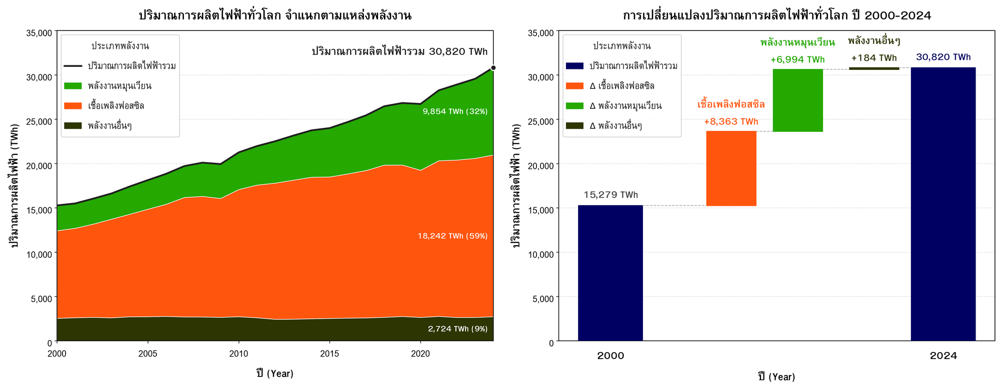

- ภาพที่ 2: ปริมาณการผลิตไฟฟ้ารายปีจากเชื้อเพลิงฟอสซิลเทียบกับพลังงานหมุนเวียน ปี 2000–2024 (แสดงเป็น Stacked Area วางซ้อนกันในแต่ละปีเพื่อดูยอดรวมของปีนั้น หน่วย TWh ผลลัพธ์แสดงว่าเชื้อเพลิงฟอสซิลไม่ได้ลดลงเลย แต่กลับเพิ่มขึ้นควบคู่ไปกับพลังงานหมุนเวียนตลอดทั้งช่วง)
- ภาพที่ 3: ส่วนต่างของปริมาณไฟฟ้าที่เพิ่มขึ้นจากเชื้อเพลิงฟอสซิลและพลังงานหมุนเวียน ระหว่างปี 2000 กับ 2024 (แสดงเป็นกราฟ Waterfall หน่วย TWh ผลลัพธ์ชี้ว่าเชื้อเพลิงฟอสซิลได้รับส่วนแบ่งของการเติบโตมากกว่า คือเพิ่มขึ้น +8,363 TWh เทียบกับพลังงานหมุนเวียนที่เพิ่มขึ้น +6,994 TWh)

**ข้อสรุปสำคัญ (Key Takeaways):** ตลอดช่วงปี 2000–2024 การผลิตไฟฟ้ารวมของโลกเพิ่มขึ้นเกือบสองเท่า จาก 15,279 เป็น 30,820 TWh สะท้อนการขยายตัวอย่างต่อเนื่องของความต้องการไฟฟ้าในระดับโลก ขณะเดียวกัน แม้การผลิตไฟฟ้าจากพลังงานหมุนเวียนจะเติบโตขึ้นอย่างชัดเจนและมีสัดส่วนเพิ่มขึ้นในช่วงหลัง แต่การขยายตัวดังกล่าว ยังไม่ได้มาพร้อมกับการลดลงของการผลิตไฟฟ้าจากเชื้อเพลิงฟอสซิล โดยในช่วงเวลาเดียวกัน การผลิตไฟฟ้าจากเชื้อเพลิงฟอสซิลเพิ่มขึ้น 8,363 TWh ขณะที่พลังงานหมุนเวียนเพิ่มขึ้น 6,994 TWh

ดังนั้น หากพิจารณาการเปลี่ยนแปลงระหว่างปี 2000 และ 2024 ในภาพรวมระดับโลก การเติบโตของพลังงานหมุนเวียนยังเกิดขึ้น ควบคู่ไปกับการขยายตัวของเชื้อเพลิงฟอสซิล มากกว่าการเข้ามาเปลี่ยนผ่านการผลิตจากเชื้อเพลิงฟอสซิลโดยตรง และเมื่อส่วนเพิ่มของการผลิตจากเชื้อเพลิงฟอสซิลยังมีขนาดมากกว่าส่วนเพิ่มจากพลังงานหมุนเวียน ภาพรวมดังกล่าวจึงมีลักษณะ “Addition” มากกว่า “Transition” ตามนิยามของโปรเจกต์

🌟 อย่างไรก็ตาม ตลอดหลายสิบปีที่ผ่านมา หลายประเทศทั่วโลกต่างรณรงค์และลงทุนกับพลังงานหมุนเวียนอย่างจริงจังไม่น้อย จึงเกิดคำถามว่าเหตุใดภาพรวมจึงยังปรากฏลักษณะ Addition อยู่ เป็นไปได้หรือไม่ว่าการพิจารณาเพียงจุดเริ่มต้น (ปี 2000) เทียบกับจุดปลาย (ปี 2024) กำลังกลบสัญญาณการเปลี่ยนแปลงบางอย่างที่เกิดขึ้น "ระหว่างทาง" ไว้ ดังนั้นจึงจำเป็นต้องพิจารณา "แนวโน้ม" ของการเติบโตในแต่ละช่วงเวลาเพิ่มเติม เพื่อดูว่าการขยายตัวของพลังงานหมุนเวียนและเชื้อเพลิงฟอสซิลเปลี่ยนแปลงไปอย่างไรในแต่ละช่วงเวลา

---

## 5-Year Rolling Window: Trend Analysis

เทียบแค่จุดเริ่มกับจุดจบ อาจพลาดเรื่องราวระหว่างทาง จึงใช้เทคนิค **5-Year Rolling Window** ดูการเปลี่ยนแปลงทีละช่วง 5 ปีที่เลื่อนไปเรื่อย ๆ

**Figure 4: จุดเปลี่ยนปี 2016 พลังงานหมุนเวียนแซงฟอสซิล (5-Year Rolling Window: Share of New Generation)**

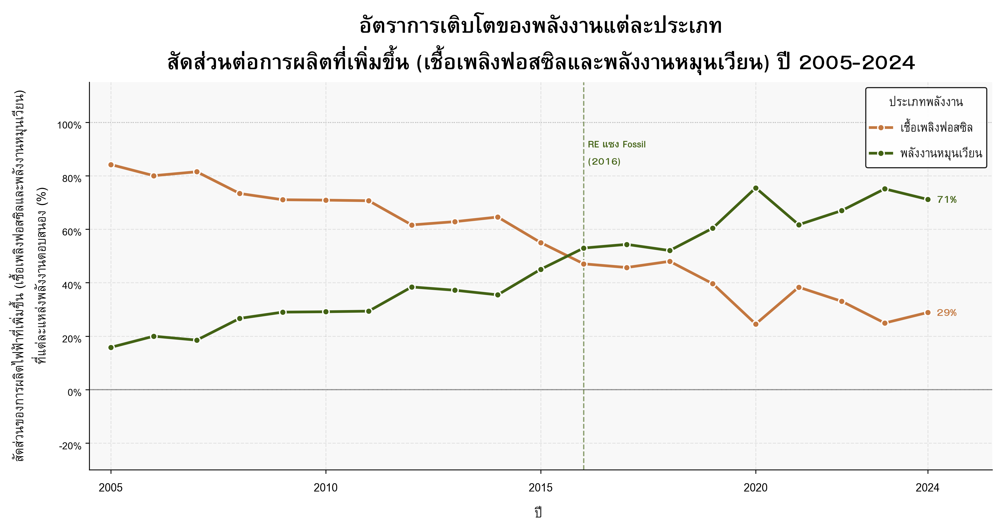

- ภาพที่ 4: สัดส่วนของเชื้อเพลิงฟอสซิลและพลังงานหมุนเวียนที่รองรับการเพิ่มขึ้นของไฟฟ้าใหม่ในแต่ละช่วง 5 ปี ปี 2005–2024 (แสดงเป็น % ของไฟฟ้าใหม่ในแต่ละช่วง ผลลัพธ์ชี้ว่าโครงสร้างการเติบโตเปลี่ยนจากพึ่งพาฟอสซิลเป็นหลักในช่วงต้น มาเป็นพลังงานหมุนเวียนแซงหน้าตั้งแต่ปี 2016 และครองสัดส่วนถึง 71% ในปี 2024)

**ข้อสรุปสำคัญ (Key Takeaways):** ช่วงแรก (2005–2007) เชื้อเพลิงฟอสซิลรองรับไฟฟ้าใหม่ถึง 80% ขึ้นไป พลังงานหมุนเวียนมีบทบาทน้อยกว่ามาก แต่สัดส่วนของเชื้อเพลิงฟอสซิลลดลงต่อเนื่อง ขณะที่พลังงานหมุนเวียนเพิ่มขึ้นเรื่อย ๆ

**จุดเปลี่ยนคือปี 2016** ปีแรกที่พลังงานหมุนเวียนรองรับไฟฟ้าใหม่ได้มากกว่าเชื้อเพลิงฟอสซิล ในปี 2024 ล่าสุด พลังงานหมุนเวียนรับบทบาทถึง **71%** ของไฟฟ้าที่เพิ่มขึ้นในช่วง 5 ปีล่าสุด ส่วนเชื้อเพลิงฟอสซิลเหลือ **29%**

ข้อมูลนี้ทำให้เห็นว่า ภาพรวม 24 ปีและภาพของช่วงล่าสุดไม่ได้ขัดแย้งกัน แต่กำลังเล่า **มิติใหม่จากข้อมูลเดียวกัน**
- ถ้ามอง **2000 → 2024**: เชื้อเพลิงฟอสซิลยังเพิ่มขึ้นมาก และภาพรวมยังใกล้เคียง Addition
- ถ้ามอง **ช่วง 5 ปีล่าสุด**: พลังงานหมุนเวียนกลายเป็นแหล่งพลังงานหลักที่รองรับไฟฟ้าใหม่ ขณะที่บทบาทของเชื้อเพลิงฟอสซิลในการรองรับไฟฟ้าใหม่ลดลงอย่างชัดเจน
**ยังสรุปไม่ได้ว่า** โลกเข้าสู่ Energy Transition สมบูรณ์แล้ว แต่ผลจาก Figure 4 ที่ใช้เทคนิค 5-Year Rolling Window เป็นสัญญาณชัดว่า **โครงสร้างของการเติบโตของระบบไฟฟ้ากำลังเปลี่ยนไป** โดยพลังงานหมุนเวียนมีบทบาทมากขึ้นในการรองรับไฟฟ้าใหม่

💡 ผลลัพธ์นี้แสดงว่าสัญญาณของการ **"เปลี่ยนผ่าน"** ที่กำลังพิจารณาอยู่นั้นมีอยู่จริง มิใช่เพียงความคาดหวังที่ปราศจากหลักฐานรองรับ 

อย่างไรก็ตาม ผลจากการวิเคราาะห์แนวโน้มเป็นช่วง 5 ปี เป็นภาพรวมของทั้งโลก จึงยังไม่สามารถบอกได้ว่าแนวโน้มดังกล่าวเกิดขึ้นในประเทศส่วนใหญ่ หรือเกิดจากการเปลี่ยนแปลงของบางประเทศที่มีขนาดระบบไฟฟ้าขนาดใหญ่ 

คำถามถัดไปจึงไม่ใช่เพียงว่า “โลกกำลังเปลี่ยนไปอย่างไร” แต่คือ “การเปลี่ยนแปลงนี้เกิดขึ้นที่ไหน?” หากพลังงานหมุนเวียนมีบทบาทเพิ่มขึ้นในการรองรับไฟฟ้าใหม่ในระดับโลก เราจำเป็นต้องตรวจสอบต่อว่า รูปแบบดังกล่าวกระจายตัวไปในทิศทางเดียวกันในแต่ละประเทศหรือไม่ และเมื่อมองในระดับภูมิภาค จะพบรูปแบบที่แตกต่างกันหรือไม่?

---

## วิเคราะห์ข้อมูลระดับภูมิภาค (Regional Comparison)

**Figure 5: จำแนกประเทศทั่วโลก Transition vs Addition (Global Country Classification)**

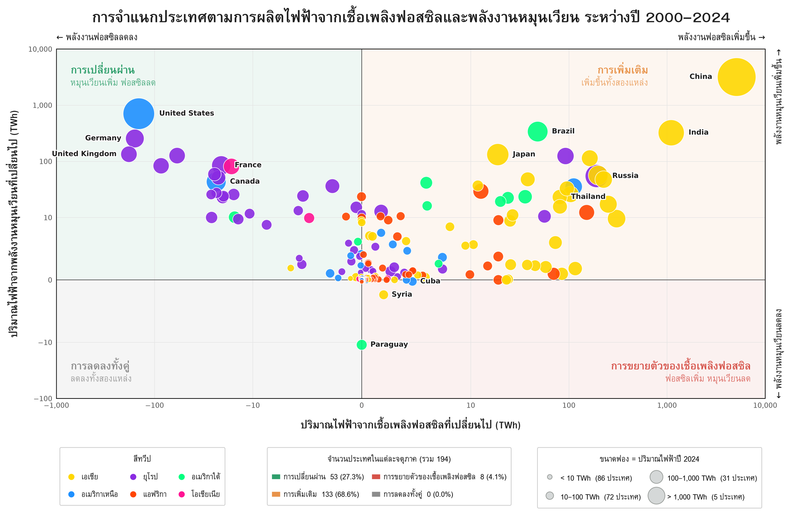

- ภาพที่ 5: การจำแนกประเทศตามผลต่างปริมาณไฟฟ้าจากเชื้อเพลิงฟอสซิล (แกน X) เทียบกับพลังงานหมุนเวียน (แกน Y) ปี 2000–2024 หน่วย TWh ทั้งสองแกน (ใช้สเกล symlog เพื่อให้เห็นทั้งประเทศเล็กและประเทศใหญ่อย่างจีนในกราฟเดียวกันได้) ขนาดฟองแทนปริมาณไฟฟ้ารวมของประเทศในปี 2024 สีฟองแยกตามทวีป (ดู legend ในภาพ) และพื้นหลังแบ่งเป็น 4 โซนตามนิยามในตารางที่ 1 คือ สีเขียวอ่อน = Transition, สีส้มอ่อน = Addition, สีเทา = Decline, สีแดงอ่อน = Fossil Expansion

**ข้อสรุปสำคัญ (Key Takeaways):** เมื่อพิจารณาการกระจายตัวของประเทศในภาพที่ 5 พบว่า รูปแบบการเปลี่ยนแปลงของระบบไฟฟ้าไม่ได้เกิดขึ้นในทิศทางเดียวกันทั่วโลก ประเทศจำนวนมากที่มีการเติบโตของปริมาณไฟฟ้า มีแนวโน้มอยู่ในกลุ่ม **Addition**  ในขณะเดียวกัน ยังพบประเทศอีกกลุ่มหนึ่งที่มีรูปแบบที่ตรงกับนิยาม **Transition** ของโปรเจกต์

ดังนั้น ภาพที่ 5 แสดงให้เห็นจึงไม่ใช่เพียงว่าประเทศใดมีพลังงานหมุนเวียนเพิ่มขึ้นมากที่สุด แต่ช่วยให้เห็นว่า **การเติบโตของพลังงานหมุนเวียนเกิดขึ้นภายใต้บริบทของระบบไฟฟ้าที่แตกต่างกัน** บางประเทศกำลังเพิ่มพลังงานใหม่เพื่อรองรับการเติบโตของระบบ ขณะที่บางประเทศมีการเพิ่มพลังงานหมุนเวียนพร้อมกับการลดลงของการผลิตไฟฟ้าจากเชื้อเพลิงฟอสซิล

---
**Figure 6: Transition vs Addition รายทวีป (Regional Breakdown by Continent)**

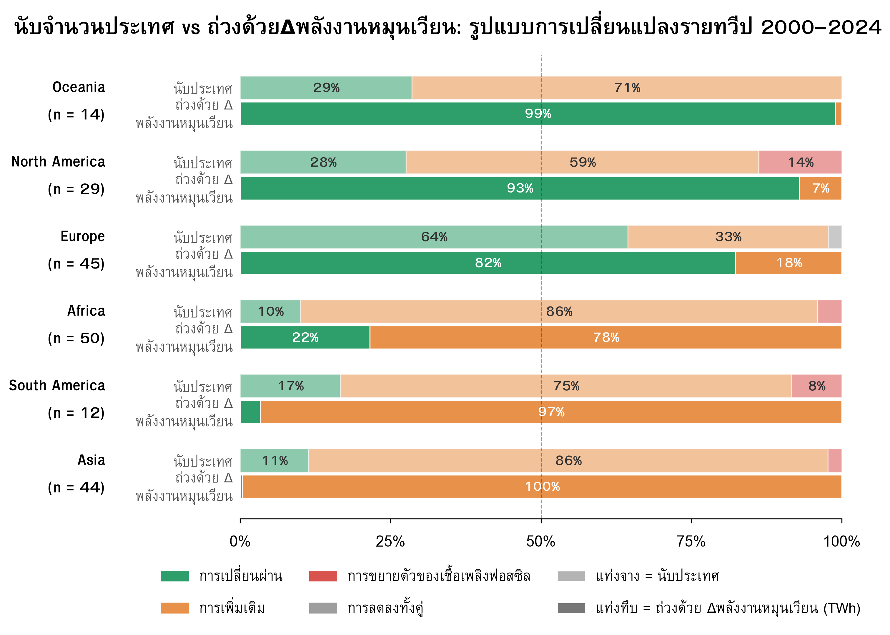

- ภาพที่ 6: การจำแนกประเทศด้วยเกณฑ์เดียวกับภาพที่ 5 แต่แบ่งการแสดงผลตามทวีป โดยประเทศทั้งหมดในโลกยังคงแสดงเป็นจุดสีจางเพื่อใช้เป็นบริบทในการเปรียบเทียบ และเมื่อลองพิจารณาในระดับภูมิภาค ความแตกต่างระหว่างประเทศมีความชัดเจนมากขึ้น โดยเฉพาะระหว่างเอเชีย แอฟริกา อเมริกาเหนือ และยุโรป

---
**Figure 7: สองทวีปที่ภาพพลิก อีกสี่ทวีปที่ภาพเข้มขึ้น (Country Count vs Δrenewable-Weighted by Continent)**

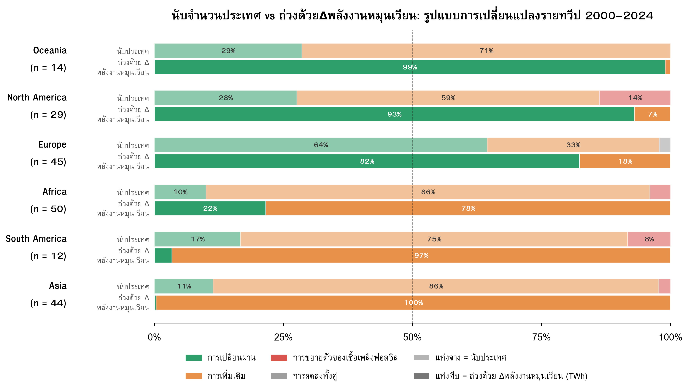

- ภาพที่ 7: สัดส่วนรูปแบบการเปลี่ยนแปลงของแต่ละทวีป ปี 2000–2024 แสดงทวีปละ 2 แท่ง แท่งจางคือสัดส่วนเมื่อนับจำนวนประเทศ (1 ประเทศ = 1 เสียง) แท่งทึบคือสัดส่วนเมื่อถ่วงตามขนาดการเติบโตของพลังงานหมุนเวียนจริง (Δrenewable, TWh) สีแสดงประเภทตามเกณฑ์ในตารางที่ 1 และ n คือจำนวนประเทศในแต่ละทวีป

**ข้อสรุปสำคัญ (Key Takeaways):** เมื่อถ่วงน้ำหนักตามขนาดการเติบโตของพลังงานหมุนเวียนจริง (Δrenewable) พบสองรูปแบบที่ต่างกันชัดเจน

- **กลุ่มที่ 1 — ทิศทางพลิกกลับ:** ใน **อเมริกาเหนือ** และ **โอเชียเนีย** ประเทศส่วนใหญ่ (โดยจำนวน) อยู่ในกลุ่ม Addition (59% และ 71%) แต่เมื่อถ่วงน้ำหนักแล้ว **Transition กลับครองเกิน 90%** ของทั้งทวีป (93% และ 99%) เพราะมีประเทศขนาดใหญ่เพียง 1-2 ประเทศที่มีขนาดการเติบโตของพลังงานหมุนเวียนมากกว่าประเทศ Addition เล็ก ๆ ในทวีปเดียวกันรวมกันทั้งหมด
- **กลุ่มที่ 2 — ทิศทางเดียวกัน แค่เข้มขึ้น:** ใน **เอเชีย แอฟริกา อเมริกาใต้ และยุโรป** ทั้งการนับหัวและการถ่วงน้ำหนักชี้ไปทางเดียวกัน เพียงแต่การถ่วงน้ำหนักทำให้สัดส่วนเอียงแรงขึ้นไปอีก เช่น เอเชียมี Addition อยู่แล้ว 86% โดยนับหัว และขยับเป็น 100% เมื่อถ่วงน้ำหนัก สะท้อนว่าประเทศขนาดใหญ่ในทวีปเหล่านี้เดินไปในทิศทางเดียวกับประเทศส่วนใหญ่อยู่แล้ว ไม่ได้ฝืนแนวโน้มของทวีป
ดังนั้น อิทธิพลของประเทศขนาดใหญ่ไม่ได้ทำให้ผลของทุกทวีป "พลิก" เสมอไป แต่ขึ้นอยู่กับว่าประเทศใหญ่นั้นบังเอิญอยู่ฝั่งเดียวกับเสียงข้างมากหรือไม่ ในกรณีที่ไม่อยู่ฝั่งเดียวกัน (อเมริกาเหนือ, โอเชียเนีย) ขนาดจะเป็นตัวชนะเสมอ

> 📑 **หมายเหตุ:** ภาพนี้ถ่วงน้ำหนักด้วย Δrenewable เพียงแกนเดียว ไม่ได้ถ่วงด้วย Δfossil คู่กัน เนื่องจากตามนิยามในตารางที่ 1 การเพิ่มขึ้นของพลังงานหมุนเวียน (Δren ≥ 0) เกิดขึ้นได้เฉพาะในกลุ่ม Transition และ Addition เท่านั้น จึงเป็นแกนที่ตรงกับคำถามของภาพนี้พอดี คือ "การเติบโตของพลังงานหมุนเวียนจริงกระจุกอยู่ในประเทศกลุ่มไหน" ส่วนคำถามว่าฟอสซิลไปเพิ่มหรือลดที่ไหน ได้ตอบแล้วในภาพรวมระดับโลก (ภาพที่ 2-3) และการจัดกลุ่ม Transition/Addition ที่ใช้ในภาพนี้ก็คำนวณจากทั้งสองแกนอยู่แล้ว การเพิ่มแกน Δfossil เข้ามาถ่วงอีกชุดจะทำให้ต้องมีแท่งเพิ่มอีกเท่าตัวโดยไม่ได้เปลี่ยนข้อสรุปหลักของภาพนี้

🌟 ยิ่งไปกว่านั้น ภาพที่ 7 ชี้ว่าอิทธิพลของประเทศขนาดใหญ่ไม่ได้ส่งผลเหมือนกันทุกทวีป ใน **อเมริกาเหนือและโอเชียเนีย** ประเทศขนาดใหญ่เพียง 1-2 ประเทศพลิกผลของทั้งทวีปให้ต่างจากเสียงข้างมาก ขณะที่ทวีปอื่นประเทศขนาดใหญ่เดินไปทางเดียวกับประเทศส่วนใหญ่อยู่แล้ว คำถามจึงขยับไปเป็น **"ประเทศใดคือตัวขับเคลื่อนหลักของแต่ละทวีป และประเทศเหล่านั้นเทียบกับประเทศอื่นทั่วโลกอย่างไร"** ซึ่งจะตอบต่อในการวิเคราะห์ระดับประเทศด้านล่าง

---

## วิเคราะห์ข้อมูลระดับประเทศ (Country-Level Analysis)

จากคำถามข้างต้น หัวข้อนี้จัดอันดับประเทศตามผลต่างการผลิตไฟฟ้าระหว่างปี 2000–2024 สองด้านคู่กัน คือด้าน**พลังงานหมุนเวียน** (ตารางที่ 3) และด้าน**เชื้อเพลิงฟอสซิล** (ตารางที่ 4) การวางสองตารางนี้คู่กันช่วยให้เห็นได้ทันทีว่า ประเทศที่เพิ่มพลังงานหมุนเวียนมากที่สุด เป็นประเทศเดียวกับที่เพิ่มเชื้อเพลิงฟอสซิลมากที่สุดหรือไม่ ซึ่งเป็นคำถามหลักที่ตัดสินว่าประเทศนั้นเข้าเกณฑ์ Transition หรือ Addition ตามนิยามในตารางที่ 1

**Table 3: 10 อันดับประเทศที่เพิ่มพลังงานหมุนเวียนมากที่สุด (Top Countries by Renewable Growth)**

**Table 4: 10 อันดับประเทศที่เพิ่มเชื้อเพลิงฟอสซิลมากที่สุด (Top Countries by Fossil Growth)**

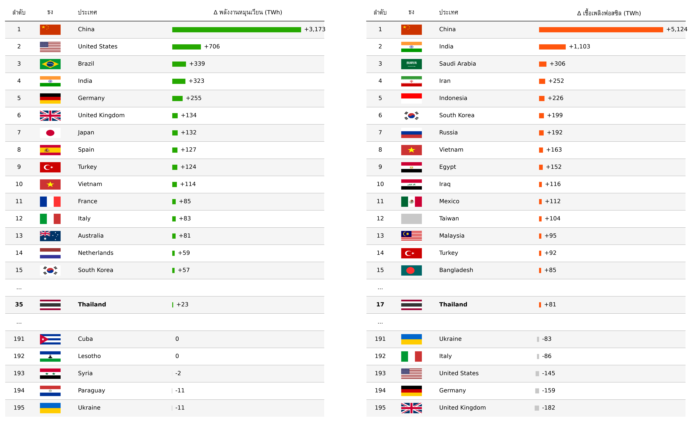

- ตารางที่ 3-4: จัดอันดับประเทศตามผลต่างของการผลิตไฟฟ้าจากพลังงานหมุนเวียนและเชื้อเพลิงฟอสซิลระหว่างปี 2000–2024 ตามลำดับ หน่วย TWh โดยแสดง 15 อันดับแรก อันดับของประเทศไทย และ 5 อันดับสุดท้ายของแต่ละด้าน

**ข้อสรุปสำคัญ (Key Takeaways):** เมื่อเทียบสองตารางคู่กัน พบว่าประเทศอันดับ 1 ของทั้งสองด้านคือประเทศเดียวกัน ได้แก่ **จีน** ซึ่งเพิ่มพลังงานหมุนเวียนมากที่สุด (+3,173 TWh) และเพิ่มเชื้อเพลิงฟอสซิลมากที่สุดในโลกเช่นกัน (+5,124 TWh) เช่นเดียวกับ**อินเดีย**ที่ติดอันดับต้นทั้งสองด้าน (+323 และ +1,103 TWh ตามลำดับ) สะท้อนว่าสำหรับจีนและอินเดีย การเพิ่มพลังงานหมุนเวียนไม่ได้มาแทนที่เชื้อเพลิงฟอสซิล แต่เพิ่มเข้ามาควบคู่กัน ซึ่งเข้าเกณฑ์ **Addition** ตามนิยามของโปรเจกต์

ในทางกลับกัน **สหรัฐอเมริกา**ติดอันดับต้นของ Table 3 (+706 TWh) แต่ไม่ติดอันดับต้นของ Table 4 สะท้อนว่าการเพิ่มพลังงานหมุนเวียนของสหรัฐฯ ไม่ได้มาพร้อมการเพิ่มเชื้อเพลิงฟอสซิลในระดับเดียวกัน ซึ่งเป็นสัญญาณเริ่มต้นของรูปแบบ **Transition** ที่จะเห็นภาพชัดขึ้นเมื่อนำทั้งสองด้านมาพิจารณาพร้อมกันในตารางที่ 5

---
**figure 8: ผลต่างของพลังงานหมุนเวียนและเชื้อเพลิงฟอสซิล 10 อันดับแรกของกลุ่ม Transition (ซ้าย) และ Addition (ขวา) ปี 2000 → 2024**

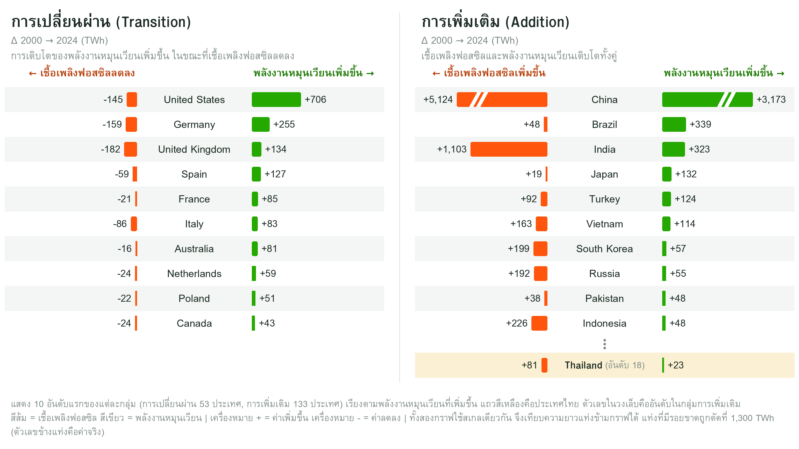

- ภาพที่ 8: แสดง 10 อันดับแรกของแต่ละกลุ่ม (Transition และ Addition) เรียงตามการเพิ่มขึ้นของพลังงานหมุนเวียน โดยตัวเลขในวงเล็บคืออันดับภายในกลุ่ม

**ข้อสรุปสำคัญ (Key Takeaways):** 
- **Transition: ส่วนใหญ่หมุนเวียนที่เพิ่มมากกว่าฟอสซิลที่ลด** ใน 8 จาก 10 ประเทศ เช่น สหรัฐฯ หมุนเวียนเพิ่ม 706 TWh ฟอสซิลลด 145 TWh มีสองประเทศที่ฟอสซิลลดมากกว่าหมุนเวียนที่เพิ่ม คือสหราชอาณาจักร (ลด 182 เพิ่ม 134) และอิตาลี (ลด 86 เพิ่ม 83) เพราะไฟฟ้ารวมลดลงด้วย (สหราชอาณาจักร −93 TWh อิตาลีแทบไม่เปลี่ยน −2 TWh)
- **Addition: ไม่เหมือนกันทั้งกลุ่ม** ป้าย "การเพิ่มเติม" เหมือนกันหมด แต่ในกราฟเห็นสองแบบ กลุ่มแรกฟอสซิลเพิ่มน้อยกว่าหมุนเวียนที่เพิ่ม (บราซิล +339 เทียบ +48, ญี่ปุ่น +132 เทียบ +19, ตุรกี, ปากีสถาน) เกือบเป็น Transition กลุ่มที่สองฟอสซิลเพิ่มมากกว่าหมุนเวียน (จีน อินเดีย เวียดนาม เกาหลีใต้ รัสเซีย อินโดนีเซีย) จีนเพิ่มหมุนเวียนมากที่สุดในโลก (+3,173) แต่ฟอสซิลเพิ่มมากกว่า (+5,124)
- **ไทย** อยู่อันดับ 18 จาก 125 ประเทศในกลุ่ม Addition หมุนเวียนเพิ่ม 23 TWh ฟอสซิลเพิ่ม 81 TWh หรือราว 3.5 เท่า

---
**Map 1: ประเทศที่อยู่ในกลุ่ม Transition อยู่ที่ไหน (World Map of Transition Pattern)**

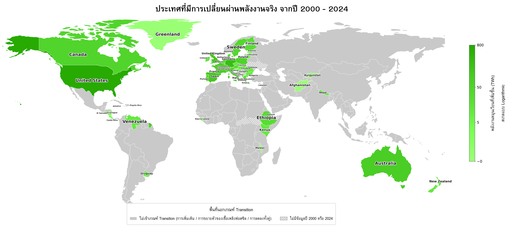

- ภาพแผนที่ 1: แผนที่โลกแสดงปริมาณพลังงานหมุนเวียนที่เพิ่มขึ้นเฉพาะประเทศที่เข้าเกณฑ์ Transition ระหว่างปี 2000–2024 โดยระดับสีแสดงปริมาณการเพิ่มขึ้นของการผลิตไฟฟ้าจากพลังงานหมุนเวียน หน่วย TWh (log scale)

---

## สองกลุ่มต่างกันตรงไหน เมื่อเทียบเป็นสัดส่วน (What Separates the Two Groups in Proportion?)

🌟 ภาพที่ 8 แสดงว่าประเทศ Addition หลายประเทศเพิ่มพลังงานหมุนเวียนมากไม่แพ้กลุ่ม Transition (จีน +3,173 TWh บราซิล +339 อินเดีย +323 เทียบกับเยอรมนี +255 สหราชอาณาจักร +134) แต่ตัวเลขเหล่านี้เป็น TWh จึงขึ้นกับขนาดของประเทศ ประเทศใหญ่ย่อมเพิ่มได้มากกว่า ส่วนนี้จึงเปลี่ยนมาเทียบเป็น **สัดส่วนต่อขนาดระบบไฟฟ้าของแต่ละประเทศเอง** (% ของไฟฟ้าที่ผลิตปี 2000) เพื่อดูว่า **เมื่อปรับตามขนาดประเทศแล้ว สองกลุ่มต่างกันตรงไหน**

**วัดอย่างไร:** วัดทั้งสองอย่างเป็นสัดส่วน (% ของไฟฟ้าที่ผลิตปี 2000) ช่วงปี 2000 → 2024

- **หมุนเวียนที่เพิ่ม** = (ไฟฟ้าจากหมุนเวียนปี 2024 − ปี 2000) ÷ ไฟฟ้าที่ผลิตปี 2000
- **ความต้องการที่โต** = (ไฟฟ้าที่ผลิตปี 2024 − ปี 2000) ÷ ไฟฟ้าที่ผลิตปี 2000

> 📑 **หมายเหตุ:** ในโปรเจกต์นี้ใช้ปริมาณไฟฟ้าที่ผลิตแทนความต้องการไฟฟ้า จึงไม่รวมผลของการนำเข้า-ส่งออกไฟฟ้าและการสูญเสียในระบบ

---
**Figure 9: แต่ละประเทศอยู่ตรงไหน (Where Each Country Sits: Renewable Growth vs Demand Growth)**

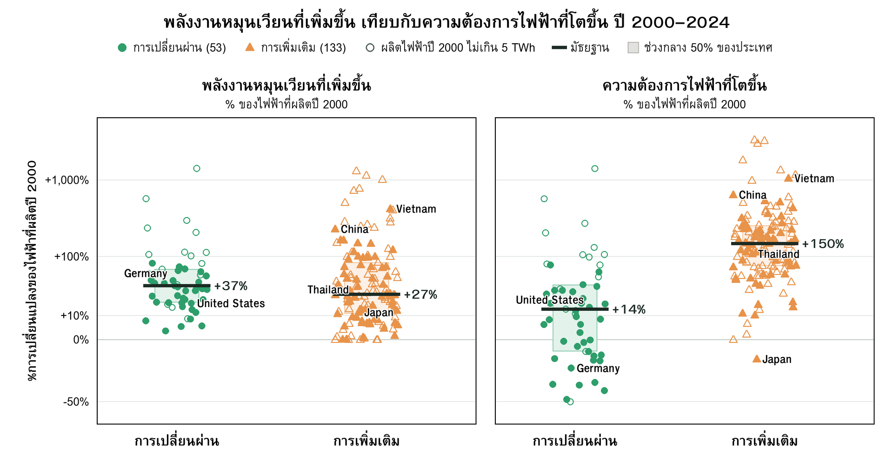

- ภาพที่ 9: ความต้องการไฟฟ้าที่โต (แกน X) เทียบกับหมุนเวียนที่เพิ่ม (แกน Y) ปี 2000 → 2024 ทั้งสองแกนเป็น % ของไฟฟ้าที่ผลิตปี 2000 และใช้สเกลเดียวกัน (symlog: ยืดค่าน้อย ย่อค่ามาก เพื่อแสดงประเทศที่ความต้องการลดลงได้) เส้นประคือหมุนเวียนที่เพิ่มเท่ากับไฟฟ้าใหม่พอดี เส้นประคือจุดที่พลังงานหมุนเวียนที่เพิ่มขึ้นเท่ากับปริมาณไฟฟ้าใหม่ที่ต้องรองรับพอดี ประเทศเหนือเส้นเพิ่มพลังงานหมุนเวียนมากกว่าปริมาณไฟฟ้าใหม่ (รองรับได้หมด เชื้อเพลิงฟอสซิลจึงลด) ประเทศใต้เส้นเพิ่มพลังงานหมุนเวียนน้อยกว่าปริมาณไฟฟ้าใหม่ (รองรับได้บางส่วน ที่เหลือส่วนใหญ่ตกเป็นของเชื้อเพลิงฟอสซิล) วงกลมเขียว = Transition สามเหลี่ยมเหลือง = Addition สี่เหลี่ยมเทา = กลุ่มอื่น จุดกลวงคือประเทศที่ผลิตไฟฟ้าปี 2000 ไม่เกิน 5 TWh

**ข้อสรุปสำคัญ (Key Takeaways):** ประเทศ Transition (สีเขียว) กระจายอยู่ด้านซ้ายและเหนือเส้นประ ส่วนประเทศ Addition (สีเหลือง) กระจายอยู่ด้านขวาและใต้เส้นประ ภาพที่ต่อไปจะทำคือการแยกสองตัวชี้วัดออกมาเทียบกลุ่มต่อกลุ่ม เพื่อดูว่าสองกลุ่มนี้ต่างกันที่ตัวไหน

**Figure 10: หมุนเวียนที่เพิ่มใกล้เคียงกัน แต่ความต้องการโตต่างกันมาก (Renewable Growth vs Demand Growth by Group)**

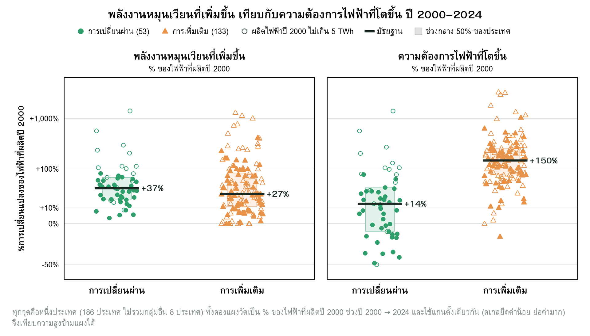

- ภาพที่ 10: เปรียบเทียบประเทศ Transition (55 ประเทศ) กับ Addition (125 ประเทศ) ใน 2 ตัวชี้วัด คือ หมุนเวียนที่เพิ่ม (ซ้าย) และความต้องการไฟฟ้าที่โต (ขวา) ทั้งสองวัดเป็น % ของไฟฟ้าที่ผลิตปี 2000 ช่วงปี 2000 → 2024 เพื่อให้เทียบข้ามประเทศขนาดต่างกันได้ และใช้แกนตั้งเดียวกัน (สเกลยืดค่าน้อย ย่อค่ามาก) จุดคือหนึ่งประเทศ แถบหนาคือมัธยฐาน กล่องคือช่วงที่ประเทศครึ่งหนึ่งของกลุ่มอยู่ จุดกลวงคือประเทศที่ผลิตไฟฟ้าปี 2000 ไม่เกิน 5 TWh (ผลลัพธ์ชี้ว่าหมุนเวียนที่เพิ่มซ้อนทับกัน แต่ความต้องการต่างกันชัดเจน) กลุ่มอื่น (Fossil Expansion และ Decline) 14 ประเทศไม่นำมาเทียบ

**ข้อสรุปสำคัญ (Key Takeaways):**

1. **หมุนเวียนที่เพิ่มใกล้เคียงกัน (ซ้าย):** มัธยฐาน +36% ในกลุ่ม Transition และ +30% ในกลุ่ม Addition กล่องของสองกลุ่มทับกันเกือบทั้งหมด แสดงว่าประเทศ Addition ไม่ได้เพิ่มพลังงานหมุนเวียนน้อยกว่าประเทศ Transition เมื่อเทียบตามขนาดระบบไฟฟ้าของตัวเอง (จีนเพิ่ม +234% ของฐานปี 2000 แต่ก็ยังเป็น Addition)
2. **ความต้องการที่โตต่างกันมาก (ขวา):** มัธยฐาน +14% ในกลุ่ม Transition และ +155% ในกลุ่ม Addition กล่องของ Transition (−3% ถึง +38%) อยู่ต่ำกว่ากล่องของ Addition (+76% ถึง +265%) โดยไม่ทับกัน
3. **เมื่ออ่านรวมกัน:** สองกลุ่มสร้างหมุนเวียนได้พอ ๆ กัน แต่ความต้องการของประเทศ Addition โตมากกว่ากลุ่ม Transition เกือบ 11 เท่า (มัธยฐาน +155% เทียบ +14%) หมุนเวียนจึงรองรับไฟฟ้าใหม่ได้ไม่หมด ส่วนที่เหลือตกเป็นของแหล่งอื่น ซึ่งส่วนใหญ่คือเชื้อเพลิงฟอสซิล

💡 ผลลัพธ์นี้แสดงว่า **ประเทศ Addition ไม่ได้เพิ่มพลังงานหมุนเวียนน้อยกว่าประเทศ Transition** สิ่งที่ต่างกันคือความต้องการไฟฟ้าที่โตมากกว่ามาก การเพิ่มพลังงานหมุนเวียนให้เร็วอย่างเดียวจึงไม่พอ ต้องเพิ่มให้เกินไฟฟ้าใหม่

> 📑 **ข้อควรระวัง:**
> - **ประเทศฐานเล็ก (จุดกลวง) มีเปอร์เซ็นต์สูงเกินจริงได้** จึงใช้มัธยฐานและกล่อง ซึ่งไม่ไวต่อค่าสุดขั้ว

---

## บทสรุป (Summary)

กลับมาที่คำถามตั้งต้น — **พลังงานหมุนเวียน กำลังเปลี่ยนผ่านเชื้อเพลิงฟอสซิล หรือแค่เพิ่มเติมเข้าระบบ?**

คำตอบคือ **ทั้งสองอย่างเกิดขึ้นพร้อมกัน คนละที่ คนละเวลา**

- **ระดับโลก (2000–2024):** เมื่อมองตลอดช่วง 24 ปี ทั้งพลังงานหมุนเวียนและเชื้อเพลิงฟอสซิลเพิ่มขึ้น และเชื้อเพลิงฟอสซิลเพิ่มมากกว่าพลังงานหมุนเวียน จึงมีลักษณะใกล้เคียง **Addition** มากกว่า Transition
- **แนวโน้มช่วงหลัง (5-Year Rolling Window):** บทบาทของพลังงานหมุนเวียนในการรองรับไฟฟ้าใหม่เพิ่มขึ้นอย่างต่อเนื่อง และตั้งแต่ปี 2016 พลังงานหมุนเวียนรองรับไฟฟ้าใหม่ได้มากกว่าเชื้อเพลิงฟอสซิล โดยช่วง 5 ปีล่าสุดอยู่ที่ 71% เทียบกับ 29% ของไฟฟ้าใหม่
- **ระดับประเทศ:** บางประเทศเข้าสู่รูปแบบ Transition แล้วจริง ขณะที่ประเทศที่ความต้องการไฟฟ้าโตเร็วยังมีลักษณะ Addition
- **สองกลุ่มต่างกันตรงไหน:** เมื่อเทียบเป็นสัดส่วนของขนาดระบบไฟฟ้า ประเทศ Addition ไม่ได้เพิ่มพลังงานหมุนเวียนน้อยกว่าประเทศ Transition (มัธยฐาน +30% เทียบ +36%) แต่ความต้องการไฟฟ้าโตมากกว่ามาก (+155% เทียบ +14%) จนหมุนเวียนรองรับไฟฟ้าใหม่ได้ไม่หมด

ดังนั้น ภาพที่ได้ไม่ใช่โลกที่ "ยังไม่ Transition" หรือ "Transition แล้วทั้งหมด" แต่เป็น **โลกที่กำลังเปลี่ยนผ่านในอัตราและรูปแบบที่แตกต่างกัน**

**สรุปสั้นๆ:** Energy Transition กำลังเกิดขึ้นจริง แต่ไม่พร้อมกันทุกประเทศ และการเติบโตของพลังงานหมุนเวียนเพียงอย่างเดียวไม่เพียงพอที่จะบอกว่าเชื้อเพลิงฟอสซิลกำลังถูกแทนที่ ต้องดูควบคู่กับการเติบโตของความต้องการไฟฟ้า

- 💡 **แนวทางเชิงนโยบาย (Action Plan):** การทำ Energy Transition ให้สำเร็จ ตั้งเป้าสร้างพลังงานหมุนเวียนให้เยอะอย่างเดียวไม่พอ ต้องสร้างให้ **เร็วกว่าและใหญ่กว่าไฟฟ้าใหม่ที่ต้องรองรับ** เพราะเป็นเงื่อนไขที่ทำให้เชื้อเพลิงฟอสซิลเริ่มลด (สหรัฐฯ ทำได้ ส่วนจีนซึ่งความต้องการโตเร็วกว่ามากยังไม่ถึงจุดนั้น) ควบคู่กับแผนลดหรือปลดระวางโรงไฟฟ้าเชื้อเพลิงฟอสซิลอย่างจริงจัง

---

## ทีมงานและเครดิต

**กลุ่ม: OUT OF TOKEN**

**แหล่งข้อมูล:** Our World in Data / Ember Climate — Electricity Generation by Country and Source (2000–2025)

